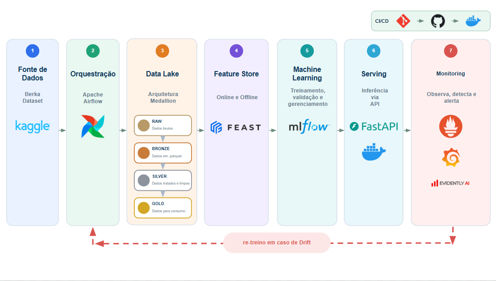
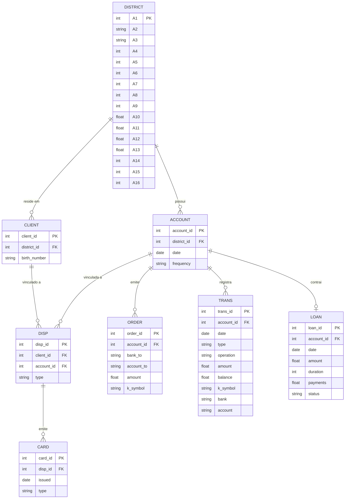
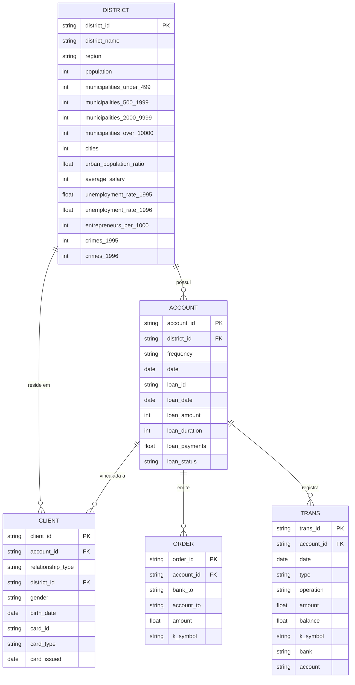

# The Bank Project

O projeto consiste em 3 etapas.
- Extração, processamento, enriquecimento e armazenamento dos dados utilizados;
- Geração de um modelo de ML;
- Geração de um chat conversacional;

## Pipeline

A imagem a seguir apresenta as principais etapas do pipeline elaborado para o projeto.\
O fluxo é orquestrado via Airflow, iniciando com o download dos arquivos brutos, a criação das camadas Bronze, Silver e Gold, até a configuração da _feature store_, o treinamento, validação e promoção dos modelos.



O diagrama mostra a arquitetura-alvo: do monitoramento (Fase 7 do `ROADMAP.md`), Prometheus e Grafana já estão no ar; o drift (Evidently) e o re-treino automático ainda não foram implementados.

Cada etapa do pipeline é idempotente (reexecutar sobrescreve o resultado, sem duplicar nada) e pode ser executada individualmente, via Makefile:

| Comando          | Etapa                                                                                           |
| ---------------- | ----------------------------------------------------------------------------------------------- |
| `make ingest`    | Kaggle → Raw (`.csv`) → Bronze (`.parquet`)                                                     |
| `make silver`    | Bronze → Silver (tipagem, nulos, traduções e reestruturação)                                    |
| `make gold`      | Silver → Gold (`gold_account` e `gold_account_monthly_movements`)                               |
| `make features`  | Feast: registra as views e carrega o online store                                               |
| `make labels`    | Labels do modelo de regressão (`next_month_outflow`) a partir da Gold                           |
| `make train`     | Treina os candidatos e registra o vencedor como `challenger` no MLflow                          |
| `make promote`   | O `challenger` se torna `champion` caso supere os resultados do modelo atual                    |
| `make drift`     | Relatório de drift (Evidently): treino x últimos meses da Gold, em `data/monitoring/`            |
| `make serve`     | API de inferência e interface web, localmente (http://localhost:8000)                           |
| `make up`/`down` | Sobe e derruba o Airflow (:8080), o MLflow (:5000), a API (:8000), o Prometheus (:9090) e o Grafana (:3000), via Docker |
| `make monitoring-check` | Valida `prometheus.yml` e `alerts.yml` com o `promtool` (Docker)                    |
| `make check`     | Lint, type check e testes                                                                       |

Nota: para baixar os arquivos brutos, as credenciais do Kaggle precisam estar no arquivo `.env`, conforme o modelo em `.env.example`.

## Dados

### Camada Bronze
O ponto de partida deste projeto é o [The Berka Dataset](https://www.kaggle.com/datasets/marceloventura/the-berka-dataset). Este conjunto de dados reúne informações financeiras de um banco tcheco, com transações de 1993 a 1998.\
Temos disponíveis oito tabelas. Na Bronze **todos os campos são gravados como string** (cópia 1:1 do `.csv`, sem tipagem nem tratamento de nulos): os tipos reais são aplicados na Silver, e o formato de origem aparece na descrição de cada campo.

#### `account`

4.500 registros.

| Campo         | Tipo   | Descrição                                                                                                                          |
| ------------- | ------ | ---------------------------------------------------------------------------------------------------------------------------------- |
| `account_id`  | string | Chave de identificação da conta. **PK**                                                                                            |
| `district_id` | string | Chave de identificação do distrito. **FK** → `district.A1`                                                                         |
| `date`        | string | Data de criação da conta, no formato `AAMMDD`.                                                                                     |
| `frequency`   | string | Frequência de emissão do extrato: `POPLATEK MESICNE` (mensal), `POPLATEK TYDNE` (semanal) ou `POPLATEK PO OBRATU` (por transação). |

#### `card`

892 registros.

| Campo     | Tipo   | Descrição                                                                                          |
| --------- | ------ | -------------------------------------------------------------------------------------------------- |
| `card_id` | string | Chave de identificação do cartão. **PK**                                                           |
| `disp_id` | string | Chave de identificação do `disp` (elemento que relaciona o cliente e suas contas). **FK** → `disp` |
| `issued`  | string | Data de emissão do cartão, no formato `AAMMDD` (com sufixo de hora `00:00:00`).                    |
| `type`    | string | Tipo de cartão: `junior`, `classic` ou `gold`.                                                     |

#### `client`

5.369 registros.

| Campo          | Tipo   | Descrição                                                                                       |
| -------------- | ------ | ----------------------------------------------------------------------------------------------- |
| `client_id`    | string | Chave de identificação do cliente. **PK**                                                       |
| `district_id`  | string | Chave de identificação do distrito de residência. **FK** → `district.A1`                        |
| `birth_number` | string | Data de nascimento e sexo: `AAMMDD` para homens e `AAMM+50DD` (mês somado de 50) para mulheres. |

#### `disp`

5.369 registros. Relaciona cada cliente à sua conta. Somente o proprietário pode emitir ordens ou realizar empréstimos.

| Campo        | Tipo   | Descrição                                                           |
| ------------ | ------ | ------------------------------------------------------------------- |
| `disp_id`    | string | Chave de identificação do `disp`. **PK**                            |
| `client_id`  | string | Identificador do cliente. **FK** → `client`                         |
| `account_id` | string | Identificador da conta. **FK** → `account`                          |
| `type`       | string | Tipo de `disp`: `OWNER` (proprietário) ou `DISPONENT` (dependente). |

#### `district`

77 registros.

| Campo | Tipo   | Descrição                                                |
| ----- | ------ | -------------------------------------------------------- |
| `A1`  | string | Identificador do distrito. **PK**                        |
| `A2`  | string | Nome do distrito.                                        |
| `A3`  | string | Região.                                                  |
| `A4`  | string | Número de habitantes.                                    |
| `A5`  | string | Número de municípios com menos de 499 habitantes.        |
| `A6`  | string | Número de municípios com 500 a 1999 habitantes.          |
| `A7`  | string | Número de municípios com 2000 a 9999 habitantes.         |
| `A8`  | string | Número de municípios com mais de 10000 habitantes.       |
| `A9`  | string | Número de cidades.                                       |
| `A10` | string | Proporção de habitantes urbanos.                         |
| `A11` | string | Salário médio.                                           |
| `A12` | string | Taxa de desemprego em 1995 (`?` no distrito 69).         |
| `A13` | string | Taxa de desemprego em 1996.                              |
| `A14` | string | Número de empreendedores por 1000 habitantes.            |
| `A15` | string | Número de crimes cometidos em 1995 (`?` no distrito 69). |
| `A16` | string | Número de crimes cometidos em 1996.                      |

#### `loan`

682 registros.

| Campo        | Tipo   | Descrição                                                                                                                                                                      |
| ------------ | ------ | ------------------------------------------------------------------------------------------------------------------------------------------------------------------------------ |
| `loan_id`    | string | Chave de identificação do empréstimo. **PK**                                                                                                                                   |
| `account_id` | string | Chave de identificação da conta. **FK** → `account`                                                                                                                            |
| `date`       | string | Data de concessão do empréstimo, no formato `AAMMDD`.                                                                                                                          |
| `amount`     | string | Valor do empréstimo.                                                                                                                                                           |
| `duration`   | string | Duração do empréstimo, em meses.                                                                                                                                               |
| `payments`   | string | Valor do pagamento mensal.                                                                                                                                                     |
| `status`     | string | Situação de pagamento do empréstimo: `A` (contrato encerrado, sem dívidas), `B` (encerrado, empréstimo não pago), `C` (em vigor, em dia) ou `D` (em vigor, cliente em débito). |

#### `order`

6.471 registros.

| Campo        | Tipo   | Descrição                                                                                                                           |
| ------------ | ------ | ----------------------------------------------------------------------------------------------------------------------------------- |
| `order_id`   | string | Chave de identificação da ordem. **PK**                                                                                             |
| `account_id` | string | Chave de identificação da conta emissora. **FK** → `account`                                                                        |
| `bank_to`    | string | Código do banco destinatário, composto por duas letras.                                                                             |
| `account_to` | string | Chave de identificação da conta destinatária.                                                                                       |
| `amount`     | string | Valor debitado da conta.                                                                                                            |
| `k_symbol`   | string | Propósito do pagamento: `POJISTNE` (seguro), `SIPO` (doméstico), `LEASING` (leasing), `UVER` (empréstimo) ou `" "` (não informado). |

#### `trans`

1.056.320 registros.

| Campo        | Tipo   | Descrição                                                                                                                                                                                                                                                                               |
| ------------ | ------ | --------------------------------------------------------------------------------------------------------------------------------------------------------------------------------------------------------------------------------------------------------------------------------------- |
| `trans_id`   | string | Chave de identificação da transação. **PK**                                                                                                                                                                                                                                             |
| `account_id` | string | Chave de identificação da conta. **FK** → `account`                                                                                                                                                                                                                                     |
| `date`       | string | Data da transação, no formato `AAMMDD`.                                                                                                                                                                                                                                                 |
| `type`       | string | Tipo de transação: `PRIJEM` (crédito), `VYDAJ` (débito) ou `VYBER` (saque; variação legada de `VYDAJ` para um subconjunto de transações).                                                                                                                                               |
| `operation`  | string | Modo de realização da transação: `VYBER KARTOU` (saque com cartão), `VKLAD` (depósito em dinheiro), `PREVOD Z UCTU` (transferência recebida, de outro banco), `VYBER` (saque em dinheiro) ou `PREVOD NA UCET` (transferência enviada, para outro banco). Vazio em parte das transações. |
| `amount`     | string | Valor da transação.                                                                                                                                                                                                                                                                     |
| `balance`    | string | Saldo da conta após a transação.                                                                                                                                                                                                                                                        |
| `k_symbol`   | string | Caracterização da transação: `POJISTNE` (seguro), `SLUZBY` (tarifa de emissão de extrato), `UROK` (juros), `SANKC. UROK` (juros de penalidade por saldo negativo), `SIPO` (pagamento doméstico), `DUCHOD` (pensão), `UVER` (pagamento de empréstimo) ou vazio.                          |
| `bank`       | string | Código do banco parceiro, composto por duas letras (aplicável apenas a transferências).                                                                                                                                                                                                 |
| `account`    | string | Chave de identificação da conta parceira (aplicável apenas a transferências).                                                                                                                                                                                                           |

#### Diagrama Entidade-Relacionamento (conjunto original)
O diagrama abaixo descreve o schema original do Berka Dataset (8 tabelas),
tal como chega na camada Raw/Bronze.



### Camada Silver

O schema de origem tem 8 tabelas e uma hierarquia de 4 níveis (`district → account/client → disp → card/loan/order/trans`). \
Para simplificar os relacionamentos e reduzir os joins necessários nas etapas seguintes, uniram-se os dados de `disp` e `card` na tabela `client`. \
O mesmo processo foi realizado com os dados da tabela `loan` em `account`. \
Já `district` permanece como tabela dimensão separada (só as colunas A1..A16 foram renomeadas), pois um join simples já resolve a relação sem
introduzir ambiguidade.

Para realizar essas alterações foram aplicadas as seguintes validações:
- todo `client` tem exatamente 1 `disp` (nenhum cliente possui mais de uma conta, nenhuma conta com mais de 1 titular ou mais de 1 dependente, e
  nunca o mesmo `client_id` como titular e dependente da mesma conta); \
- todo `card` pertence a um `disp` do tipo `OWNER` (titular) único (nenhum dependente tem cartão, nenhum titular tem mais de 1 cartão); \
- toda `account` possui no máximo 1 `loan`.

Como resultado, temos as seguintes tabelas:

#### `district`

77 registros. Tabela dimensão; colunas `A1`..`A16` renomeadas e tipadas (o `?` de `A12` e `A15` no distrito 69 vira nulo).

| Campo                       | Fonte Bronze   | Tipo   | Descrição                                                |
| --------------------------- | -------------- | ------ | -------------------------------------------------------- |
| `district_id`               | `district.A1`  | string | Identificador do distrito. **PK**                        |
| `district_name`             | `district.A2`  | string | Nome do distrito.                                        |
| `region`                    | `district.A3`  | string | Região.                                                  |
| `population`                | `district.A4`  | int    | Número de habitantes.                                    |
| `municipalities_under_499`  | `district.A5`  | int    | Número de municípios com menos de 499 habitantes.        |
| `municipalities_500_1999`   | `district.A6`  | int    | Número de municípios com 500 a 1999 habitantes.          |
| `municipalities_2000_9999`  | `district.A7`  | int    | Número de municípios com 2000 a 9999 habitantes.         |
| `municipalities_over_10000` | `district.A8`  | int    | Número de municípios com mais de 10000 habitantes.       |
| `cities`                    | `district.A9`  | int    | Número de cidades.                                       |
| `urban_population_ratio`    | `district.A10` | float  | Proporção de habitantes urbanos.                         |
| `average_salary`            | `district.A11` | int    | Salário médio.                                           |
| `unemployment_rate_1995`    | `district.A12` | float  | Taxa de desemprego em 1995. Nula no distrito 69.         |
| `unemployment_rate_1996`    | `district.A13` | float  | Taxa de desemprego em 1996.                              |
| `entrepreneurs_per_1000`    | `district.A14` | int    | Número de empreendedores por 1000 habitantes.            |
| `crimes_1995`               | `district.A15` | int    | Número de crimes cometidos em 1995. Nulo no distrito 69. |
| `crimes_1996`               | `district.A16` | int    | Número de crimes cometidos em 1996.                      |

#### `client`

5.369 registros. Consolida `client` + `disp` + `card`.

| Campo               | Fonte Bronze                      | Tipo   | Descrição                                                                                                                  |
| ------------------- | --------------------------------- | ------ | -------------------------------------------------------------------------------------------------------------------------- |
| `client_id`         | `client.client_id`                | string | Chave de identificação do cliente. **PK**                                                                                  |
| `account_id`        | `disp.account_id`                 | string | Conta do cliente (todo cliente pertence a exatamente 1 conta). **FK** → `account`                                          |
| `relationship_type` | `disp.type`                       | string | Papel do cliente na conta: `TITULAR` (proprietário; único que pode emitir ordens ou contrair empréstimos) ou `DEPENDENTE`. |
| `district_id`       | `client.district_id`              | string | Distrito de residência. **FK** → `district`                                                                                |
| `gender`            | Derivado de `client.birth_number` | string | Sexo do cliente (`M`/`F`).                                                                                                 |
| `birth_date`        | Derivado de `client.birth_number` | date   | Data de nascimento.                                                                                                        |
| `card_id`           | `card.card_id`                    | string | Chave de identificação do cartão. Nulo para os 4.477 clientes sem cartão (só titular pode ter).                            |
| `card_type`         | `card.type`                       | string | Tipo de cartão: `junior`, `classic` ou `gold`. Nulo sem cartão.                                                            |
| `card_issued`       | `card.issued`                     | date   | Data de emissão do cartão. Nula sem cartão.                                                                                |

#### `account`

4.500 registros. Consolida `account` + `loan`.

| Campo           | Fonte Bronze          | Tipo   | Descrição                                                                                                                                                                                              |
| --------------- | --------------------- | ------ | ------------------------------------------------------------------------------------------------------------------------------------------------------------------------------------------------------ |
| `account_id`    | `account.account_id`  | string | Chave de identificação da conta. **PK**                                                                                                                                                                |
| `district_id`   | `account.district_id` | string | Distrito da conta. **FK** → `district`                                                                                                                                                                 |
| `frequency`     | `account.frequency`   | string | Frequência de emissão do extrato: `MENSAL`, `SEMANAL` ou `POR_TRANSACAO`.                                                                                                                              |
| `date`          | `account.date`        | date   | Data de criação da conta.                                                                                                                                                                              |
| `loan_id`       | `loan.loan_id`        | string | Chave de identificação do empréstimo. Nulo para as 3.818 contas sem empréstimo.                                                                                                                        |
| `loan_date`     | `loan.date`           | date   | Data de concessão do empréstimo. Nula sem empréstimo.                                                                                                                                                  |
| `loan_amount`   | `loan.amount`         | float  | Valor do empréstimo. Nulo sem empréstimo.                                                                                                                                                              |
| `loan_duration` | `loan.duration`       | int    | Duração do empréstimo, em meses. Nula sem empréstimo.                                                                                                                                                  |
| `loan_payments` | `loan.payments`       | float  | Valor do pagamento mensal. Nulo sem empréstimo.                                                                                                                                                        |
| `loan_status`   | `loan.status`         | string | Situação de pagamento do empréstimo: `A` (contrato encerrado, sem dívidas), `B` (encerrado, empréstimo não pago), `C` (em vigor, em dia) ou `D` (em vigor, cliente em débito). Nulo se sem empréstimo. |

#### `order`

6.471 registros. Mesmo schema da origem, tipada e com `k_symbol` traduzido.

| Campo        | Fonte Bronze       | Tipo   | Descrição                                                                                                            |
| ------------ | ------------------ | ------ | -------------------------------------------------------------------------------------------------------------------- |
| `order_id`   | `order.order_id`   | string | Chave de identificação da ordem. **PK**                                                                              |
| `account_id` | `order.account_id` | string | Conta emissora. **FK** → `account`                                                                                   |
| `bank_to`    | `order.bank_to`    | string | Código do banco destinatário, composto por duas letras.                                                              |
| `account_to` | `order.account_to` | string | Chave de identificação da conta destinatária.                                                                        |
| `amount`     | `order.amount`     | float  | Valor debitado da conta.                                                                                             |
| `k_symbol`   | `order.k_symbol`   | string | Propósito do pagamento: `SEGURO`, `PAGAMENTO_DOMESTICO`, `LEASING` ou `PAGAMENTO_EMPRESTIMO`. Nulo se não informado. |

#### `trans`

1.056.320 registros. Mesmo schema da origem, tipada e com as categóricas traduzidas.

| Campo        | Fonte Bronze       | Tipo   | Descrição                                                                                                                                                     |
| ------------ | ------------------ | ------ | ------------------------------------------------------------------------------------------------------------------------------------------------------------- |
| `trans_id`   | `trans.trans_id`   | string | Chave de identificação da transação. **PK**                                                                                                                   |
| `account_id` | `trans.account_id` | string | Conta da transação. **FK** → `account`                                                                                                                        |
| `date`       | `trans.date`       | date   | Data da transação.                                                                                                                                            |
| `type`       | `trans.type`       | string | Tipo de transação: `CREDITO`, `DEBITO` ou `SAQUE` (variação legada de débito, mantida separada).                                                              |
| `operation`  | `trans.operation`  | string | Modo de realização: `SAQUE_CARTAO`, `DEPOSITO_DINHEIRO`, `TRANSFERENCIA_RECEBIDA`, `SAQUE_DINHEIRO` ou `TRANSFERENCIA_ENVIADA`. Nulo em parte das transações. |
| `amount`     | `trans.amount`     | float  | Valor da transação.                                                                                                                                           |
| `balance`    | `trans.balance`    | float  | Saldo da conta após a transação.                                                                                                                              |
| `k_symbol`   | `trans.k_symbol`   | string | Caracterização: `SEGURO`, `TARIFA_EXTRATO`, `JUROS`, `JUROS_PENALIDADE`, `PAGAMENTO_DOMESTICO`, `PENSAO` ou `PAGAMENTO_EMPRESTIMO`. Nulo se não informado.    |
| `bank`       | `trans.bank`       | string | Código do banco parceiro, composto por duas letras. Nulo fora de transferências.                                                                              |
| `account`    | `trans.account`    | string | Conta parceira. Nula fora de transferências.                                                                                                                  |

Tratamentos aplicados a todas as tabelas (`src/the_bank_project/silver/`):
- **Tipagem:** datas `AAMMDD` viram `datetime` (século XX), valores numéricos viram `Int64`/`Float64`, ids permanecem texto;
- **Nulos:** os placeholders `""`, `" "` e `"?"` viram nulo (ex.: `k_symbol` em branco, `A12`/`A15` do distrito 69);
- **Categóricas traduzidas:** `frequency` (`MENSAL`, `SEMANAL`, `POR_TRANSACAO`), `relationship_type`, `trans.type`
  (`CREDITO`, `DEBITO`, `SAQUE`), `operation` e `k_symbol` (ex.: `SEGURO`, `JUROS`, `PAGAMENTO_EMPRESTIMO`).
  Um código fora do mapa interrompe o job em vez de virar nulo. `loan_status` e `card_type` mantêm o código original;
- **Validação automática:** os merges 1:1 acima são verificados a cada execução (`validate="1:1"` do pandas e
  `check_silver`), junto com chaves primárias únicas, integridade referencial, 1 titular por conta e cartão só para
  titular. Se qualquer regra falhar, nada é gravado.

#### Diagrama Entidade-Relacionamento (conjunto reestruturado)


### Camada Gold

A camada Gold consolida os dados tratados na Silver em estruturas orientadas ao consumo analítico e à geração de features para modelos de aprendizado supervisionado. \
Os dados são organizados em duas tabelas com granularidades diferentes, ambas com **`account_id` como entidade**:
- Visão cadastral da conta `gold_account`;
- Visão temporal do comportamento financeiro `gold_account_monthly_movements`;

**Por que a conta e não o cliente?** \
O Berka tem 5.369 clientes para 4.500 contas. Os 869 dependentes compartilham a conta do titular e, portanto, a mesma série de transações e o mesmo target. \
Usá-los como entidade duplicaria observações idênticas e enviesaria as métricas dos modelos. \
Os atributos do cliente que interessam (sexo e nascimento do titular, cartão) entram como atributos da conta. \
A Gold não define os modelos de ML nem seus conjuntos de treinamento. \
Seu objetivo é disponibilizar dados confiáveis, reutilizáveis e temporalmente consistentes para que diferentes times possam construir suas próprias features, visões analíticas e modelos. \
O código está em `src/the_bank_project/gold/` (`make gold`) e as tabelas são gravadas em `data/gold/`.

#### `gold_account`

Esta tabela reúne as informações referentes a conta, ao titular, seu distrito e quando existentes, os dados de empréstimo e cartão.

| Campo                             | Fonte Silver                      | Tipo    | Descrição                                                                                             |
| --------------------------------- | --------------------------------- | ------- | ----------------------------------------------------------------------------------------------------- |
| `account_id`                      | `account.account_id`              | string  | Identificador único da conta. **PK**                                                                  |
| `account_open_date`               | `account.date`                    | date    | Data de criação da conta. **Timestamp do Feast.**                                                     |
| `account_frequency`               | `account.frequency`               | string  | Frequência de emissão do extrato: `MENSAL`, `SEMANAL` ou `POR_TRANSACAO`.                             |
| `district_id`                     | `account.district_id`             | string  | Distrito da conta.                                                                                    |
| `district_name`                   | `district.district_name`          | string  | Nome do distrito da conta.                                                                            |
| `district_region`                 | `district.region`                 | string  | Região do distrito.                                                                                   |
| `district_population`             | `district.population`             | int     | População do distrito.                                                                                |
| `district_urban_ratio`            | `district.urban_population_ratio` | float   | Proporção da população urbana do distrito.                                                            |
| `district_average_salary`         | `district.average_salary`         | int     | Salário médio do distrito.                                                                            |
| `district_unemployment_1995`      | `district.unemployment_rate_1995` | float   | Taxa de desemprego em 1995 (nula no distrito 69, sem dado na origem).                                 |
| `district_unemployment_1996`      | `district.unemployment_rate_1996` | float   | Taxa de desemprego em 1996.                                                                           |
| `district_entrepreneurs_per_1000` | `district.entrepreneurs_per_1000` | int     | Número de empreendedores por 1000 habitantes.                                                         |
| `district_crimes_1995`            | `district.crimes_1995`            | int     | Crimes registrados em 1995 (nulo no distrito 69).                                                     |
| `district_crimes_1996`            | `district.crimes_1996`            | int     | Crimes registrados em 1996.                                                                           |
| `owner_client_id`                 | `client.client_id`                | string  | Cliente titular da conta.                                                                             |
| `owner_gender`                    | `client.gender`                   | string  | Sexo do titular (`M`/`F`).                                                                            |
| `owner_birth_date`                | `client.birth_date`               | date    | Data de nascimento do titular.                                                                        |
| `owner_district_id`               | `client.district_id`              | string  | Distrito de residência do titular (difere do da conta em 409 contas).                                 |
| `dependent_count`                 | Derivado de `client`              | int     | Número de dependentes da conta (0 ou 1 no dataset).                                                   |
| `has_card`                        | Derivado de `client.card_id`      | boolean | Indica se a conta tem cartão (só o titular pode ter).                                                 |
| `card_type`                       | `client.card_type`                | string  | Tipo do cartão: `junior`, `classic` ou `gold`. Nulo sem cartão.                                       |
| `card_issued_date`                | `client.card_issued`              | date    | Data de emissão do cartão. Nulo sem cartão.                                                           |
| `has_loan`                        | Derivado de `account.loan_id`     | boolean | Indica se a conta tem empréstimo.                                                                     |
| `loan_date`                       | `account.loan_date`               | date    | Data de concessão do empréstimo.                                                                      |
| `loan_amount`                     | `account.loan_amount`             | float   | Valor concedido no empréstimo.                                                                        |
| `loan_duration`                   | `account.loan_duration`           | int     | Duração do empréstimo em meses.                                                                       |
| `loan_payments`                   | `account.loan_payments`           | float   | Valor da parcela mensal.                                                                              |
| `loan_payment_ratio`              | Derivado                          | float   | Relação entre a parcela mensal e o valor do empréstimo.                                               |
| `loan_status`                     | `account.loan_status`             | string  | Situação do empréstimo (`A`–`D`). Origem do label de inadimplência, **não é feature**.                |

> **Atenção aos campos `card_*` e `loan_*`:** são atributos estáticos, medidos ao fim do período, e a tabela é datada pela abertura da conta.
> Um cartão ou empréstimo emitido depois do mês de referência de uma observação **não** estava disponível naquele momento;
> Portanto, é fundamental atenção a campos como `card_issued_date`/`loan_date` para evitar vazamento de dados.

#### `gold_account_monthly_movements`

Esta tabela reúne indicadores como volume de movimentações, entradas, saídas, saldo, composição das operações e histórico.

- **`reference_month` é o último dia do mês** (ex.: `1995-03-31`), quando as features do mês ficam completas. \
É o `event_timestamp` no Feast: uma consulta point-in-time feita em `T` só enxerga meses já encerrados.
- **Meses sem movimento entram na série**, entre o primeiro e o último mês com transação de cada conta (269 meses, 0,15%), com fluxos e contagens 0 e saldo carregado do mês anterior. \
Sem isso, `LAG` e as médias móveis olhariam para meses distantes. \
Os valores mínimo/médio/máximo das transações ficam nulos nesses meses.
- **Entradas** são as transações do tipo `CREDITO`.
- **Saídas** são `DEBITO` e `SAQUE` (o `VYBER` do tipo, variante legada de débito).
- **`opening_balance` é uma estimativa.** O `balance` do Berka não fecha como razão contábil (`closing_balance ≠ opening_balance + net_flow` em cerca de 25% dos meses) e o `trans_id` não segue a ordem real dentro do mesmo dia. \
Por isso, o saldo de abertura/fechamento do dia é resolvido pela cadeia `balance − valor` das próprias transações do dia, e não pelo `trans_id`.
- Janelas (`*_3m_*`, `*_6m_*`) usam **só o mês de referência e os anteriores**; onde há menos meses que a janela, usam os disponíveis. Variações percentuais são nulas quando o mês anterior é 0.
- `leasing_payment_amount`, previsto no desenho original, foi removido: `LEASING` só aparece em `order`, nunca em `trans`.

| Campo                          | Fonte                                   | Descrição                                                    |
| ------------------------------ | --------------------------------------- | ------------------------------------------------------------ |
| `account_id`                   | `trans.account_id`                      | Identificador da conta. **PK composta**                      |
| `reference_month`              | Derivado de `trans.date`                | Último dia do mês de referência. **PK composta, timestamp do Feast** |
| `account_age_months`           | Derivado                                | Idade da conta, em meses, no mês de referência.              |
| `year`                         | Derivado                                | Ano do mês de referência.                                    |
| `month`                        | Derivado                                | Mês do mês de referência.                                    |
| `transaction_count`            | `COUNT(trans_id)`                       | Número total de transações no mês.                           |
| `active_days`                  | `COUNT(DISTINCT date)`                  | Número de dias com movimentação.                             |
| `credit_transaction_count`     | `type = CREDITO`                        | Quantidade de transações de crédito.                         |
| `debit_transaction_count`      | `type IN (DEBITO, SAQUE)`               | Quantidade de transações de saída.                           |
| `withdrawal_transaction_count` | `operation IN (SAQUE_DINHEIRO, SAQUE_CARTAO)` | Quantidade de saques.                                  |
| `transfer_transaction_count`   | `operation IN (TRANSFERENCIA_*)`        | Quantidade de transferências (enviadas e recebidas).         |
| `inflow_amount`                | `type = CREDITO`                        | Total de recursos recebidos no mês.                          |
| `outflow_amount`               | `type IN (DEBITO, SAQUE)`               | Total de recursos debitados no mês.                          |
| `net_flow`                     | Derivado                                | Entradas menos saídas.                                       |
| `avg_transaction_amount`       | `amount`                                | Valor médio das transações.                                  |
| `min_transaction_amount`       | `amount`                                | Menor valor de transação.                                    |
| `max_transaction_amount`       | `amount`                                | Maior valor de transação.                                    |
| `opening_balance`              | Derivado de `balance`                   | Saldo estimado antes da primeira transação do mês.           |
| `closing_balance`              | Derivado de `balance`                   | Saldo após a última transação do mês.                        |
| `avg_balance`                  | `AVG(balance)`                          | Saldo médio observado nas transações do mês.                 |
| `min_balance`                  | `MIN(balance)`                          | Menor saldo observado no mês.                                |
| `max_balance`                  | `MAX(balance)`                          | Maior saldo observado no mês.                                |
| `cash_withdrawal_amount`       | `operation = SAQUE_DINHEIRO`            | Valor total de saques em dinheiro.                           |
| `card_withdrawal_amount`       | `operation = SAQUE_CARTAO`              | Valor total de saques com cartão.                            |
| `transfer_out_amount`          | `operation = TRANSFERENCIA_ENVIADA`     | Valor total de transferências enviadas.                      |
| `transfer_in_amount`           | `operation = TRANSFERENCIA_RECEBIDA`    | Valor total de transferências recebidas.                     |
| `loan_payment_amount`          | `k_symbol = PAGAMENTO_EMPRESTIMO`       | Valor total de pagamentos de empréstimos.                    |
| `insurance_payment_amount`     | `k_symbol = SEGURO`                     | Valor total de pagamentos de seguros.                        |
| `domestic_payment_amount`      | `k_symbol = PAGAMENTO_DOMESTICO`        | Valor total de pagamentos domésticos.                        |
| `interest_amount`              | `k_symbol = JUROS`                      | Valor associado a juros.                                     |
| `penalty_interest_amount`      | `k_symbol = JUROS_PENALIDADE`           | Valor associado a juros de penalidade.                       |
| `loan_payment_count`           | `k_symbol = PAGAMENTO_EMPRESTIMO`       | Quantidade de pagamentos de empréstimos.                     |
| `transfer_out_count`           | `operation`                             | Quantidade de transferências enviadas.                       |
| `transfer_in_count`            | `operation`                             | Quantidade de transferências recebidas.                      |
| `cash_withdrawal_count`        | `operation`                             | Quantidade de saques em dinheiro.                            |
| `card_withdrawal_count`        | `operation`                             | Quantidade de saques com cartão.                             |
| `previous_month_outflow`       | `LAG(outflow_amount)`                   | Total de saídas do mês anterior.                             |
| `previous_month_inflow`        | `LAG(inflow_amount)`                    | Total de entradas do mês anterior.                           |
| `outflow_3m_avg`               | Média móvel                             | Média das saídas dos últimos 3 meses (incluindo o atual).    |
| `outflow_3m_sum`               | Soma móvel                              | Soma das saídas dos últimos 3 meses.                         |
| `outflow_6m_avg`               | Média móvel                             | Média das saídas dos últimos 6 meses.                        |
| `inflow_3m_avg`                | Média móvel                             | Média das entradas dos últimos 3 meses.                      |
| `avg_balance_3m`               | Média móvel                             | Média do saldo médio dos últimos 3 meses.                    |
| `transaction_count_3m_avg`     | Média móvel                             | Média da quantidade de transações dos últimos 3 meses.       |
| `outflow_mom_change`           | Derivado                                | Variação percentual das saídas em relação ao mês anterior.   |
| `inflow_mom_change`            | Derivado                                | Variação percentual das entradas em relação ao mês anterior. |
| `balance_mom_change`           | Derivado                                | Variação absoluta do saldo de fechamento em relação ao mês anterior. |

#### Validações automáticas

`check_gold` roda a cada execução e, se qualquer regra falhar, nada é gravado:
- PK única em cada tabela e `gold_account` com exatamente as contas da Silver;
- sem nulos nos campos obrigatórios (chaves, datas, fluxos, saldos e janelas);
- toda conta da tabela mensal existe em `gold_account`;
- meses contíguos por conta e `reference_month` sempre no fim do mês;
- consistência das janelas: `outflow_3m_sum` não é menor que a saída do mês e `previous_month_outflow` bate com o mês anterior.

Os testes garantem ainda que alterar um mês futuro não muda nenhuma feature dos meses anteriores (anti-vazamento).

#### Diagrama Entidade-Relacionamento

```mermaid
erDiagram
    GOLD_ACCOUNT ||--o{ GOLD_ACCOUNT_MONTHLY_MOVEMENTS : "possui histórico mensal"

    GOLD_ACCOUNT {
        string account_id PK
        date account_open_date
        string account_frequency
        string district_id
        string district_name
        string district_region
        int district_population
        float district_urban_ratio
        int district_average_salary
        float district_unemployment_1995
        float district_unemployment_1996
        int district_entrepreneurs_per_1000
        int district_crimes_1995
        int district_crimes_1996
        string owner_client_id
        string owner_gender
        date owner_birth_date
        string owner_district_id
        int dependent_count
        boolean has_card
        string card_type
        date card_issued_date
        boolean has_loan
        date loan_date
        float loan_amount
        int loan_duration
        float loan_payments
        float loan_payment_ratio
        string loan_status
    }

    GOLD_ACCOUNT_MONTHLY_MOVEMENTS {
        string account_id PK
        date reference_month PK
        int account_age_months
        int year
        int month
        int transaction_count
        int active_days
        int credit_transaction_count
        int debit_transaction_count
        int withdrawal_transaction_count
        int transfer_transaction_count
        float inflow_amount
        float outflow_amount
        float net_flow
        float avg_transaction_amount
        float min_transaction_amount
        float max_transaction_amount
        float opening_balance
        float closing_balance
        float avg_balance
        float min_balance
        float max_balance
        float cash_withdrawal_amount
        float card_withdrawal_amount
        float transfer_out_amount
        float transfer_in_amount
        float loan_payment_amount
        float insurance_payment_amount
        float domestic_payment_amount
        float interest_amount
        float penalty_interest_amount
        int loan_payment_count
        int transfer_out_count
        int transfer_in_count
        int cash_withdrawal_count
        int card_withdrawal_count
        float previous_month_outflow
        float previous_month_inflow
        float outflow_3m_avg
        float outflow_3m_sum
        float outflow_6m_avg
        float inflow_3m_avg
        float avg_balance_3m
        float transaction_count_3m_avg
        float outflow_mom_change
        float inflow_mom_change
        float balance_mom_change
    }
```



## Feature Store

A Gold alimenta a feature store, o **único ponto de acesso às features**. \
As etapas de treino e serving passam por `the_bank_project.features`, e nenhum outro módulo lê a Gold diretamente.

- **Entidade:** `account` (chave `account_id`).
- **Offline store:** os parquets de `data/gold/` (usado no treino, com join *point-in-time*).
- **Online store:** SQLite local em `feature_repo/data/` (usado no serving), carregado com o valor mais recente de cada conta.
- **Views:** `account_static` (de `gold_account`, timestamp `account_open_date`) e `account_monthly` (de `gold_account_monthly_movements`, timestamp `reference_month`). \
O schema é explícito em `feature_repo/features.py` e um teste de contrato falha se ele divergir das colunas da Gold.
- **FeatureService `outflow_regression`:** as features da visão mensal e do histórico usadas pelo modelo de regressão. \
O target não é uma feature.

Pontos de atenção:
- **Point-in-time:** como `reference_month` é o fim do mês, uma consulta em `1995-03-30` enxerga fevereiro, não março.
- **Sem TTL:** o offline store de arquivos do Feast descarta a linha inteira quando a feature expira, e quebra se todas expirarem. \
Por isso as views não têm TTL, e o dataset de treino deve partir de pares (conta, mês) reais da Gold, não de datas arbitrárias depois do último mês da conta. \
Linhas anteriores à abertura da conta não voltam do offline store.
- **Materialização completa:** `materialize_all` reprocessa o histórico inteiro (idempotente). \
A janela incremental do Feast é limitada pelo TTL a partir de "agora", e o dataset é de 1993–1998.
- **Versão do pandas:** o Feast exige `pandas<3`, então o projeto todo está em pandas 2.3 (dev, CI, a imagem do Airflow e a da API).

## Modelos Supervisionados

A partir da camada Gold são construídos os datasets específicos para treinamento dos modelos. \
As tabelas Gold fornecem as variáveis observadas e derivadas, enquanto os **targets** são definidos de acordo com cada problema de negócio. \
Essa separação permite reutilizar a mesma Gold em diferentes modelos e evita que variáveis que representam o futuro sejam disponibilizadas como features.

### Modelo de regressão | Gastos do próximo mês

O objetivo deste modelo é prever o valor total de saídas de uma conta no mês seguinte.
Matematicamente:

```text
X(T) → y(T+1)
```

Onde:

```text
X(T) = comportamento observado até o mês T
y(T+1) = outflow da conta no mês T+1
```

**Variável alvo:**

```text
next_month_outflow = outflow_amount(T+1)
```

A variável `next_month_outflow` não faz parte da Gold nem do Feature Store. Ela é a tabela de labels (`make labels`), que desloca `outflow_amount` para o mês seguinte dentro de cada conta; as features vêm do Feast com join point-in-time em `event_timestamp` (o mês T).

**Granularidade:**

```text
1 observação = 1 conta por mês
```

A Gold tem 185.326 registros mensais (1.056.320 transações agregadas por conta). O último mês de cada conta não tem mês seguinte e não gera observação de treino, o que deixa **180.826 observações** (meses 1993-01 a 1998-11), gravadas em `data/gold/labels_outflow.parquet` (`account_id`, `event_timestamp`, `next_month_outflow`).

**Modelos:**

```text
Regressão Linear (baseline)
        ↓
Random Forest Regressor
        ↓
Gradient Boosting
        ↓
XGBoost
```

A regressão linear é o baseline de modelo; os demais verificam se relações não lineares e interações melhoram as previsões. \
O "Gradient Boosting" é o `HistGradientBoostingRegressor` do scikit-learn (o `GradientBoostingRegressor` clássico levaria dezenas de minutos neste volume). \
Junto entram **dois baselines sem treino**, repetir o `outflow_amount` do mês atual e a média dos últimos 3 meses: um modelo só conta se bater o melhor deles (`test_skill_vs_naive` = `1 − MAE/MAE do melhor ingênuo`).

**Alvo em `log1p`:** as saídas são muito assimétricas (mediana ~11 mil, máximo ~290 mil). \
Random Forest, Gradient Boosting e XGBoost treinam em `log1p(y)` e revertem antes de medir, o que reduziu o MAE de validação em ~2% (e piorou RMSE/R² em ~5%, já que o MAE é a métrica principal). \
A regressão linear **não** usa o log: ela extrapola em `log1p` e o `expm1` explode (MAE de validação 32 mil contra 8 mil sem o log).

**Métricas observadas:**

```text
MAE
RMSE
R²
```

O MAE indica diretamente o erro médio de previsão, o RMSE dá maior peso a erros elevados e o R² mede a capacidade explicativa do modelo.

#### Features

**Visão mensal:**

```text
active_days
inflow_amount
outflow_amount
net_flow
transaction_count
avg_transaction_amount
max_transaction_amount
opening_balance
closing_balance
avg_balance
min_balance
max_balance
cash_withdrawal_amount
card_withdrawal_amount
transfer_out_amount
loan_payment_amount
insurance_payment_amount
domestic_payment_amount
```

**Histórico:**

```text
previous_month_outflow
previous_month_inflow
outflow_3m_avg
outflow_3m_sum
outflow_6m_avg
inflow_3m_avg
avg_balance_3m
transaction_count_3m_avg
outflow_mom_change
inflow_mom_change
balance_mom_change
```

#### Divisão e seleção

Por causa do caráter temporal, a divisão é cronológica e feita **por mês**, escolhendo os cortes para chegar perto de 70/20/10 das *linhas* (as linhas se concentram nos anos finais, então 70% das linhas não são 70% do tempo). Entre os conjuntos há **1 mês de folga** descartado: o label de T é o outflow de T+1, então sem folga o último mês de treino usaria como label um valor que já é feature do primeiro mês de validação.

```text
Treino     1993-01 .. 1997-10   122.618 linhas
(folga     1997-11)
Validação  1997-12 .. 1998-06    31.420 linhas
(folga     1998-07)
Teste      1998-08 .. 1998-11    17.874 linhas
```

Para cada modelo, 8 configurações de hiperparâmetros sorteadas (além da padrão) são ajustadas **só no treino** e comparadas na validação. O vencedor de cada algoritmo é reajustado em treino + validação e medido **uma vez** no teste. O modelo registrado é o de menor MAE de **validação**; o teste nunca decide a seleção (há um teste automatizado que corrompe o alvo do teste e confere que o vencedor não muda).

#### Resultados (execução de 2026-09-24)

| Modelo               | MAE validação | MAE teste | RMSE teste | R² teste | Skill vs ingênuo (teste) |
| -------------------- | ------------- | --------- | ---------- | -------- | ------------------------ |
| Média dos 3 meses    | 9.918         | 8.183     | 15.871     | 0,35     | (referência)             |
| Persistência         | 11.577        | 9.197     | 18.910     | 0,08     |                          |
| Regressão linear     | 8.051         | 7.970     | 13.391     | 0,54     | 0,03                     |
| Gradient Boosting    | 7.232         | 6.637     | 12.979     | 0,57     | 0,19                     |
| XGBoost              | 7.112         | 6.557     | 12.896     | 0,57     | 0,20                     |
| **Random Forest**    | **7.059**     | **6.478** | 12.990     | 0,57     | **0,21**                 |

Como ler: os três modelos de árvores erram ~20% menos que o melhor ingênuo, e a linear só empata com ele no teste. **A diferença entre Random Forest, XGBoost e Gradient Boosting é pequena (menos de 2,5% no MAE)** e não foi testada estatisticamente; a escolha do Random Forest pela validação é uma vantagem de ~0,8% sobre o XGBoost, que não deve ser tratada como definitiva. O R² de 0,57 mostra que boa parte da variação mensal das saídas não é explicada pelas features atuais. O teste tem só 4 meses (1998-08 a 1998-11).

#### Ciclo de vida no MLflow

- **Experimento** `regressao_outflow`; **runs** `treino_<modelo>_<data>` (mais um run aninhado por configuração testada). Todos logam as mesmas métricas (`val_*` e `test_*`: MAE, RMSE e R²).
- **Registry** `outflow_regression`, com **aliases** (não stages, depreciados no MLflow): o treino registra o vencedor pela validação como `challenger`; `make promote` o transforma em `champion` se ele tiver MAE de teste **estritamente menor** que o do campeão atual. Os dois modelos são reavaliados no mesmo teste no momento do gate. Sem campeão, o primeiro `challenger` assume. O resultado do gate fica em tags da versão (`gate`, `gate_test_mae`).
- O modelo é carregável por `models:/outflow_regression@champion` (formato cloudpickle: o padrão skops exige listar cada tipo do modelo como confiável, e o registry é local).
- **Tracking:** com `MLFLOW_TRACKING_URI` definido usa o servidor (o Docker Compose sobe um); sem ele, um SQLite local em `data/mlflow/`.

---

## Inferência: API e interface

A API (FastAPI) prevê as **saídas totais de uma conta no mês seguinte**, com o modelo `champion` do MLflow e as features do Feast. Ela sobe com o restante da infraestrutura (`make up`, http://localhost:8000) ou localmente (`make serve`, com `MLFLOW_TRACKING_URI` no `.env`). \
A mesma aplicação serve a **interface web** em `/`, feita para demonstrar o valor do modelo.

### Interface

- **Herói:** o erro médio do modelo no teste contra os demais modelos e contra a regra simples "repetir a média de saídas dos 3 meses".
- **Laboratório:** o usuário escolhe o mês de referência e até 10 contas (busca pelo número ou "Sortear 5 contas"). Para cada conta, vê o **valor previsto ao lado do valor real**, o erro em Kč e em %, e o erro que a média de 3 meses teria dado. Ao clicar numa conta, aparecem o histórico de 12 meses com o previsto e o real no mês seguinte e **todas as informações que o modelo usou** (29 features, com nomes legíveis e as 5 de maior peso em destaque).
- **Desempenho geral:** o modelo é recalculado no conjunto de teste inteiro (a cada troca de campeão) e comparado com o baseline: erro médio, previsões a até 20% do real, proporção de contas-mês em que erra menos e um gráfico de dispersão previsto × real. O erro médio recalculado pela API coincide com o do MLflow.

Decisões para a interface não enganar quem a usa:
- **O mês de referência mostra a que conjunto pertence:** os meses de teste (ago–nov/1998) nunca foram vistos pelo modelo; meses de treino ou validação vêm com o aviso de que o resultado tende a ser otimista. O ponto de partida é o mês de teste mais recente.
- **Sem valor real no "mais recente":** a opção `dez/1998` prevê `jan/1999`, um mês que o dataset não tem, então só há previsão.
- **Poucas contas não provam nada:** o modelo erra menos que a média de 3 meses em ~57% das contas-mês, não em todas. Numa amostra de 5 contas o baseline pode ganhar, e a interface diz isso e aponta para o teste inteiro.

### Endpoints

| Endpoint                                | Função                                                                                   |
| --------------------------------------- | ---------------------------------------------------------------------------------------- |
| `POST /predict`                         | Previsão em lote (até 100 contas). Contrato público, consumido pelo chat da Etapa 3.     |
| `GET /health`                           | Campeão carregado e tamanho do catálogo. Responde 503 se não houver `champion`.          |
| `GET /metrics`                          | Métricas no formato Prometheus.                                                          |
| `GET /api/model`                        | Campeão, métricas no teste, comparativo com os baselines e features (nome, grupo, peso). |
| `GET /api/months`, `/api/accounts`      | Meses disponíveis (com o conjunto do treino) e busca/sorteio de contas.                  |
| `GET /api/accounts/{id}/history`        | Entradas, saídas e saldo até o mês T e o valor real de T+1.                              |
| `GET /api/evaluation`                   | Desempenho no teste inteiro (calculado em segundo plano após carregar o modelo).         |
| `GET /docs`                             | Documentação OpenAPI interativa.                                                         |

```bash
curl -X POST localhost:8000/predict -H 'content-type: application/json' \
  -d '{"account_ids": ["1", "2"], "reference_month": "1998-11-30"}'
```

```json
{
  "model": {"name": "outflow_regression", "version": "1", "algorithm": "random_forest"},
  "predictions": [
    {"account_id": "1", "features_as_of": "1998-11-30", "target_month": "1998-12-31",
     "predicted_next_month_outflow": 3812.4, "actual_next_month_outflow": 6952.0,
     "baseline_next_month_outflow": 4803.0, "error": -3139.6, "split": "teste", "features": null}
  ],
  "not_found": []
}
```

- Sem `reference_month`, a API usa o mês **mais recente** do online store (`features_as_of`) e não devolve valor real. Com ele, as features vêm do offline store no ponto do tempo pedido e o valor real de T+1 vem junto, quando conhecido. \
  Nos dois caminhos as features e a previsão são idênticas para o mesmo mês (há teste de paridade treino/serving).
- Contas sem features vão em `not_found`, sem derrubar o lote. `include_features: true` devolve as features usadas.
- **Troca de campeão sem reiniciar:** a API consulta o alias `champion` a cada 60 s e recarrega o modelo se a versão mudou. Um campeão cujas features divergem das do Feast não substitui o que está rodando.
- **Métricas Prometheus** (`/metrics`): requisições e latência por rota, previsões geradas, contas sem features, distribuição dos valores previstos e a versão do modelo carregado.

### Limitações

- **Sem autenticação:** é um projeto local.
- **Features "mais recentes" são de 1998:** o dataset é histórico e as views do Feast não têm TTL. Uma conta parada há meses seria prevista com dados velhos, e por isso a resposta traz `features_as_of`.
- **Mesmas versões em todo lugar:** a imagem da API e o venv do Airflow são instalados pelo `poetry.lock`, porque o modelo do MLflow é um pickle que só carrega com as versões com que foi treinado.

### Modelo de classificação | Inadimplência

O objetivo deste modelo é prever se um empréstimo apresentará comportamento de inadimplência. \
Label, features e métricas ainda serão definidos (Fase 5b do `ROADMAP.md`).

## Monitoramento

Com `make up`, o **Prometheus** (http://localhost:9090) faz scrape do `/metrics` da API a cada 15 s e o **Grafana** (http://localhost:3000, visualização sem login; `admin`/`admin` para editar) já abre com o dashboard "API de inferência" provisionado a partir de `monitoring/`, sem configuração manual.

| Bloco do dashboard | O que mostra                                                                                          |
| ------------------ | ----------------------------------------------------------------------------------------------------- |
| Visão geral        | API no ar, versão/algoritmo do campeão, idade do campeão carregado e requisições/s.                   |
| Tráfego e latência | Requisições/s por rota, latência p50/p95 por rota e taxa de erros 5xx.                                |
| Previsões          | Previsões e chamadas por modo, fração de contas sem features e distribuição dos valores previstos.    |

Alertas (`monitoring/alerts.yml`, visíveis em http://localhost:9090/alerts): API fora do ar, nenhum campeão carregado, 5xx acima de 5%, p95 do `/predict` acima de 1 s e mais de 20% das contas sem features. Não há Alertmanager: a infra é local e não haveria para onde notificar.

Os testes (`tests/monitoring/`) garantem que todo nome de métrica usado nos alertas e no dashboard existe em `ServingMetrics`, para que renomear uma métrica na API não quebre o painel em silêncio.

### Drift de dados

`make drift` compara, com o **Evidently**, as features que o modelo viu com as dos meses mais recentes e grava em `data/monitoring/` um relatório HTML (`drift_report.html`) e um resumo (`drift_summary.json`). As features vêm do Feast, pelo mesmo caminho do treino.

| Parâmetro (`monitoring` em `global_config.yaml`) | Valor | Significado                                                                                  |
| ------------------------------------------------ | ----- | -------------------------------------------------------------------------------------------- |
| `current_months`                                 | 3     | Janela "atual": os 3 últimos meses da Gold (ago–nov/1998 já é teste; ver "Modelo de regressão"). |
| `feature_threshold`                              | 0,1   | Uma feature deriva se a distância de Wasserstein, em desvios da referência, passa de 0,1.    |
| `drift_share_threshold`                          | 0,5   | Há drift no dataset se 50% das features (ou mais) derivam.                                   |

- **Replay temporal:** o dataset é histórico e a API não persiste requisições, então o "dado atual" é simulado: a referência são os meses de treino e validação (o que o modelo viu) e a janela atual, os últimos meses. Se a janela invadir a referência, o comando falha em vez de comparar dados iguais.
- **Drift não é erro:** o comando só falha se a etapa quebrar. Quem decide o que fazer com o resultado é a DAG (Fase 7c).
- **Resultado nos dados reais (1993-01..1998-06 x 1998-09..1998-11):** 12 de 29 features (41%) derivaram, logo abaixo do limiar, então **não há drift no dataset**. As que derivam são quase todas de nível (saldos, contagens de transações, valores de transferências), esperado num banco cujos saldos crescem ao longo dos anos; as de variação e as de entradas ficam estáveis. Com a margem tão curta, uma janela ou um limiar diferentes mudariam o veredito.
- **Amostras pequenas geram drift falso:** com poucas linhas, o ruído amostral sozinho passa de 0,1. Nos dados reais a janela tem ~13 mil linhas, sem esse problema.

O envio do resumo ao Prometheus (Pushgateway), a DAG `monitoring` e o re-treino por drift ainda estão por vir (Fase 7b/7c do `ROADMAP.md`).
