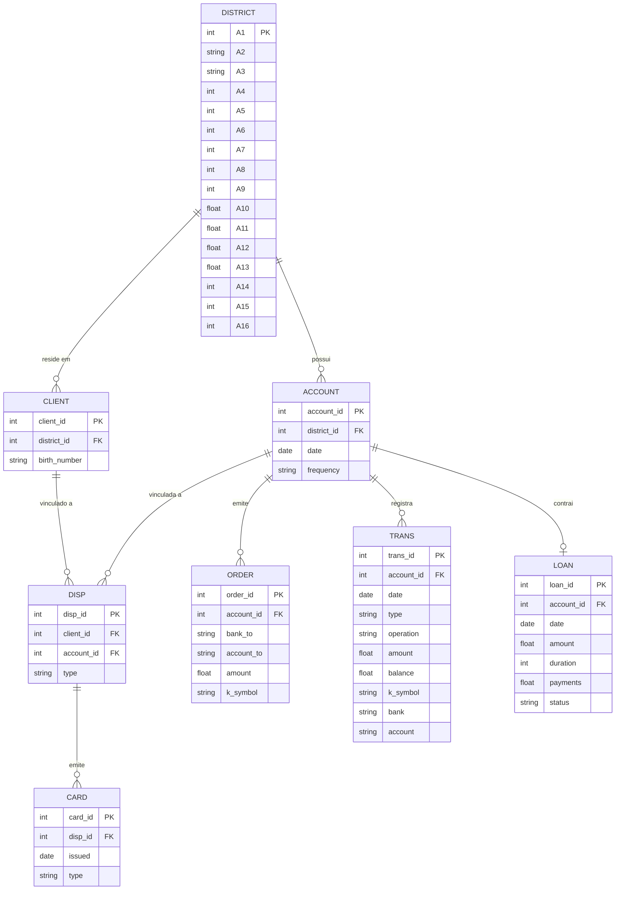
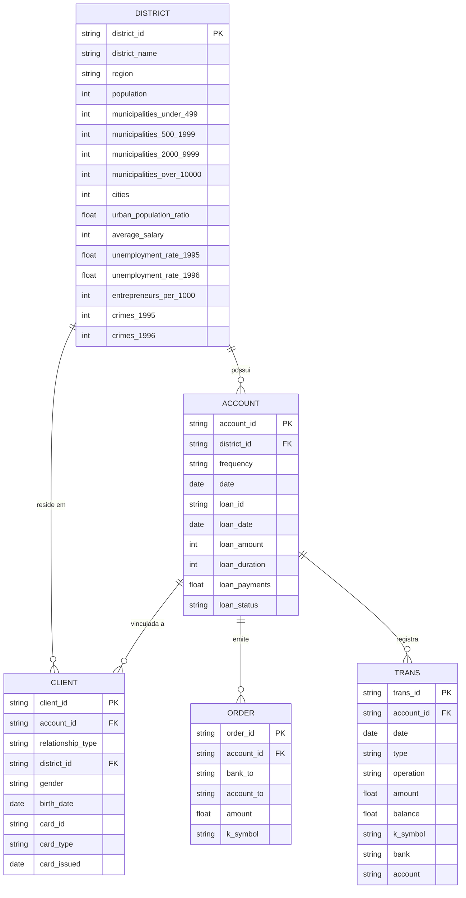

# The Bank Project

O projeto está baseado em 3 etapas.
- Extração, processamento, enriquecimento e armazenamento dos dados utilizados;
- Geração de um modelo de ML;
- Geração de um chat conversacional;

## Dados

### Camada Bronze
O ponto de partida deste projeto é o [The Berka Dataset](https://www.kaggle.com/datasets/marceloventura/the-berka-dataset), este conjunto de dados reune informações financeiras de um banco tcheco para o ano de 1999.\
Temos disponíveis oito tabelas, cada uma delas com o seguinte _schema_ de dados:

- _account_ (4500 registros):
   - account_id: Chave de identificação da conta;
   - district_id Chave de identificação do distrito;
   - date: Data de criação da conta, no formato AAMMDD;
   - frequency: Frequência de emissão do extrato
   ```
   {
      "POPLATEK MESICNE": "Mensal",
      "POPLATEK TYDNE": "Semanal",
      "POPLATEK PO OBRATU": "Por transação"
   }
   ```
- _card_ (892 registros):
   - card_id: Chave de identificação do cartão;
   - disp_id: Chave de identificação do _disp_ (elemento que relaciona o cliente e suas contas);
   - issued: Data de emissão do cartão, no formato: AAMMDD
   - type: Tipo de cartão:
   ```
      'junior', 'classic' e 'gold'
   ```
- _clients_ (5369 registros):
   - client_id: Chave de identificação do cliente;
   - district_id: Chave de identificação do distrito;
   - birth_number Data de nascimento e sexo, nos formatos AAMMDD (para homens) e AAMM+50DD (para mulheres)
- _disp_ (5369 registros):
   - disp_id: Chave de identificação do _disp_ (elemento que relaciona o cliente e suas contas);
   - client_id: Identificador do cliente;
   - account_id: Identificador da conta;
   - type: Tipo de _disp_ 
   ```
      Nota: Somente o proprietário pode emitir ordens  ou realizar empréstimos.
   ```
- _district_ (77 registros):
   - A1: district_id;
   - A2: Nome do Distrito;
   - A3: Região;
   - A4: Nº de Habitantes;
   - A5: Nº de Municípios com menos de 499 habitantes;
   - A6: Nº de Municípios com 500 a 1999 habitantes;
   - A7: Nº de Municípios com 2000 a 9999 habitantes;
   - A8: Nº de Municípios com mais de 10000 habitantes;
   - A9: Nº de Cidades;
   - A10: Proporção de habitantes urbanos;
   - A11: Salário Médio;
   - A12: Taxa de desemprego em 1995;
   - A13: Taxa de desemprego em 1996;
   - A14: Nº de Empreendedores por 1000 habitantes;
   - A15: Nº de Crimes cometidos em 1995;
   - A16: Nº de Crimes cometidos em 1996;

- _loan_ (682 registros):
   - loan_id: Chave de identificação do empréstimo;
   - account_id: Chave de identificação da conta;
   - date: Data de concessão do empréstimo, no formato AAMMDD;
   - amount: Valor do empréstimo;
   - duration: Duração do empréstimo, em meses;
   - payments: Valor do pagamento mensal;
   - status: Situação de pagamento do empréstimo
   ```
   {
      "A": "Contrato encerrado, sem dívidas",
      "B": "Contrato encerrado, empréstimo não pago",
      "C": "Contrato em vigor, em dia",
      "D": "Contrato em vigor, cliente em débito"
   }
   ```
- _order_ (6471 registros):
   - order_id: Chave de identificação da ordem;
   - account_id: Chave de identificação da conta emissora;
   - bank_to: Código do banco destinatário, composto por duas letras;
   - account_to: Chave de identificação da conta destinatária;
   - amount: Valor debitado da conta;
   - k_symbol: Propósito do pagamento
   ```
   {
      "POJISTNE": "Pagamento de seguro",
      "SIPO": "Pagamento doméstico",
      "LEASING": "Pagamento de leasing",
      "UVER": "Pagamento de empréstimo"
   }
   ```
- _trans_ (1.056.320 registros):
   - trans_id: Chave de identificação da transação;
   - account_id: Chave de identificação da conta;
   - date: Data da transação, no formato AAMMDD;
   - type: Tipo de transação
   ```
   {
      "PRIJEM": "Crédito",
      "VYDAJ": "Débito",
      "VYBER": "Saque (variação legada de VYDAJ para um subconjunto de transações)"
   }
   ```
   - operation: Modo de realização da transação
   ```
   {
      "VYBER KARTOU": "Saque com cartão",
      "VKLAD": "Depósito em dinheiro",
      "PREVOD Z UCTU": "Transferência recebida (de outro banco)",
      "VYBER": "Saque em dinheiro",
      "PREVOD NA UCET": "Transferência enviada (para outro banco)"
   }
   ```
   - amount: Valor da transação;
   - balance: Saldo da conta após a transação;
   - k_symbol: Caracterização da transação
   ```
   {
      "POJISTNE": "Pagamento de seguro",
      "SLUZBY": "Tarifa de emissão de extrato",
      "UROK": "Juros",
      "SANKC. UROK": "Juros de penalidade por saldo negativo",
      "SIPO": "Pagamento doméstico",
      "DUCHOD": "Pensão",
      "UVER": "Pagamento de empréstimo"
   }
   ```
   - bank: Código do banco parceiro, composto por duas letras (aplicável apenas a transferências);
   - account: Chave de identificação da conta parceira (aplicável apenas a transferências);

#### Diagrama Entidade-Relacionamento (conjunto original)
O diagrama abaixo descreve o schema original do Berka Dataset (8 tabelas),
tal como chega na camada Raw/Bronze. A camada Silver reorganiza esse
schema — ver [Reorganização na Silver](#reorganização-na-silver)
mais abaixo.



### Camada Silver

O schema de origem tem 8 tabelas e uma hierarquia de 4 níveis
(`district → account/client → disp → card/loan/order/trans`). Para
simplificar os relacionamentos e reduzir os joins necessários nas etapas
seguintes (modelagem) — a Silver consolida `disp` + `card` dentro de
`client`, e `loan` dentro de `account`.
`district` permanece como tabela dimensão separada (só as colunas
A1..A16 foram renomeadas), pois um join simples já resolve a relação sem
introduzir ambiguidade.

Os três merges usados na consolidação são **1:1, sem perda de dado** —
validado contra os dados reais antes da implementação:
- todo `client` tem exatamente 1 `disp` (nenhum cliente em mais de uma
  conta, nenhuma conta com mais de 1 titular ou mais de 1 dependente, e
  nunca o mesmo `client_id` como titular e dependente da mesma conta);
- todo `card` pertence a um `disp` do tipo `TITULAR` único (nenhum
  dependente tem cartão, nenhum titular tem mais de 1 cartão);
- toda `account` tem no máximo 1 `loan`.

Como resultado, temos:
- _district_ (77 registros) — colunas A1..A16 renomeadas, dados inalterados:
   - district_id (era A1), district_name (A2), region (A3), population (A4),
     municipalities_under_499 (A5), municipalities_500_1999 (A6),
     municipalities_2000_9999 (A7), municipalities_over_10000 (A8),
     cities (A9), urban_population_ratio (A10), average_salary (A11),
     unemployment_rate_1995 (A12), unemployment_rate_1996 (A13),
     entrepreneurs_per_1000 (A14), crimes_1995 (A15), crimes_1996 (A16);
- _client_ (5369 registros; consolida _client_ + _disp_ + _card_):
   - client_id: Chave de identificação do cliente;
   - account_id: Chave de identificação da conta (todo cliente pertence a exatamente 1 conta);
   - relationship_type: Papel do cliente na conta
   ```
   {
      "TITULAR": "Proprietário — único que pode emitir ordens ou contrair empréstimos",
      "DEPENDENTE": "Dependente"
   }
   ```
   - district_id: Chave de identificação do distrito de residência;
   - gender: Sexo do cliente ('M'/'F'), derivado de `birth_number`;
   - birth_date: Data de nascimento, derivada de `birth_number`;
   - card_id: Chave de identificação do cartão (nulo para os 4477 clientes sem cartão — só titular pode ter);
   - card_type: Tipo de cartão (nulo se sem cartão)
   ```
      'junior', 'classic' e 'gold'
   ```
   - card_issued: Data de emissão do cartão (nulo se sem cartão);
- _account_ (4500 registros; consolida _account_ + _loan_):
   - account_id: Chave de identificação da conta;
   - district_id: Chave de identificação do distrito da conta;
   - frequency: Frequência de emissão do extrato
   ```
   {
      "POPLATEK MESICNE": "Mensal",
      "POPLATEK TYDNE": "Semanal",
      "POPLATEK PO OBRATU": "Por transação"
   }
   ```
   - date: Data de criação da conta;
   - loan_id: Chave de identificação do empréstimo (nulo para as 3818 contas sem empréstimo);
   - loan_date: Data de concessão do empréstimo (nulo se sem empréstimo);
   - loan_amount: Valor do empréstimo (nulo se sem empréstimo);
   - loan_duration: Duração do empréstimo em meses (nulo se sem empréstimo);
   - loan_payments: Valor do pagamento mensal (nulo se sem empréstimo);
   - loan_status: Situação de pagamento do empréstimo (nulo se sem empréstimo)
   ```
   {
      "A": "Contrato encerrado, sem dívidas",
      "B": "Contrato encerrado, empréstimo não pago",
      "C": "Contrato em vigor, em dia",
      "D": "Contrato em vigor, cliente em débito"
   }
   ```
- _order_ e _trans_: mesmo schema de origem, só tipadas e com as categóricas traduzidas.

Tratamentos aplicados a todas as tabelas (`src/the_bank_project/silver/`):
- **Tipagem:** datas `AAMMDD` viram `datetime` (século XX), valores numéricos viram `Int64`/`Float64`, ids permanecem texto;
- **Nulos:** os placeholders `""`, `" "` e `"?"` viram nulo (ex.: `k_symbol` em branco, `A12`/`A15` do distrito 69);
- **Categóricas traduzidas:** `frequency` (`MENSAL`, `SEMANAL`, `POR_TRANSACAO`), `relationship_type`, `trans.type`
  (`CREDITO`, `DEBITO`, `SAQUE`), `operation` e `k_symbol` (ex.: `SEGURO`, `JUROS`, `PAGAMENTO_EMPRESTIMO`).
  Um código fora do mapa interrompe o job em vez de virar nulo. `loan_status` e `card_type` mantêm o código original;
- **Validação automática:** os merges 1:1 acima são verificados a cada execução (`validate="1:1"` do pandas e
  `check_silver`), junto com chaves primárias únicas, integridade referencial, 1 titular por conta e cartão só para
  titular. Se qualquer regra falhar, nada é gravado.

#### Diagrama Entidade-Relacionamento (conjunto reestruturado)


### Camada Gold

A camada Gold consolida os dados tratados na Silver em estruturas orientadas ao consumo analítico e à geração de features para modelos de aprendizado supervisionado. Nesta etapa, os dados são organizados em duas tabelas com diferentes granularidades: uma visão consolidada do cliente e uma visão temporal do seu comportamento financeiro.

A Gold não define os modelos de ML nem seus conjuntos de treinamento. Seu objetivo é disponibilizar dados confiáveis, reutilizáveis e temporalmente consistentes para que diferentes times possam construir suas próprias features, visões analíticas e modelos.

#### `gold_client`

A tabela `gold_client` consolida as informações cadastrais, demográficas e financeiras em uma visão única para cada cliente, com granularidade de um registro por `client_id`. A tabela reúne atributos do cliente, distrito de residência, relacionamento com a conta, cartão e características do empréstimo, quando existentes.

| Campo                             | Fonte Silver                      | Tipo    | Descrição                                                                                             |
| --------------------------------- | --------------------------------- | ------- | ----------------------------------------------------------------------------------------------------- |
| `client_id`                       | `client.client_id`                | string  | Identificador único do cliente. **PK**                                                                |
| `account_id`                      | `client.account_id`               | string  | Identificador da conta associada ao cliente.                                                          |
| `relationship_type`               | `client.relationship_type`        | string  | Papel do cliente na conta: `TITULAR` ou `DEPENDENTE`.                                                 |
| `gender`                          | `client.gender`                   | string  | Sexo do cliente, derivado de `birth_number`.                                                          |
| `birth_date`                      | `client.birth_date`               | date    | Data de nascimento do cliente.                                                                        |
| `district_id`                     | `client.district_id`              | string  | Identificador do distrito de residência.                                                              |
| `district_name`                   | `district.district_name`          | string  | Nome do distrito de residência.                                                                       |
| `district_region`                 | `district.region`                 | string  | Região do distrito.                                                                                   |
| `district_population`             | `district.population`             | int     | População do distrito.                                                                                |
| `district_urban_ratio`            | `district.urban_population_ratio` | float   | Proporção da população urbana do distrito.                                                            |
| `district_average_salary`         | `district.average_salary`         | int     | Salário médio do distrito.                                                                            |
| `district_unemployment_1995`      | `district.unemployment_rate_1995` | float   | Taxa de desemprego do distrito em 1995.                                                               |
| `district_unemployment_1996`      | `district.unemployment_rate_1996` | float   | Taxa de desemprego do distrito em 1996.                                                               |
| `district_entrepreneurs_per_1000` | `district.entrepreneurs_per_1000` | int     | Número de empreendedores por 1000 habitantes.                                                         |
| `district_crimes_1995`            | `district.crimes_1995`            | int     | Número de crimes registrados em 1995.                                                                 |
| `district_crimes_1996`            | `district.crimes_1996`            | int     | Número de crimes registrados em 1996.                                                                 |
| `account_district_id`             | `account.district_id`             | string  | Identificador do distrito da conta.                                                                   |
| `account_frequency`               | `account.frequency`               | string  | Frequência de emissão do extrato.                                                                     |
| `account_open_date`               | `account.date`                    | date    | Data de criação da conta.                                                                             |
| `has_card`                        | Derivado de `client.card_id`      | boolean | Indica se o cliente possui cartão.                                                                    |
| `card_type`                       | `client.card_type`                | string  | Tipo do cartão: `junior`, `classic` ou `gold`.                                                        |
| `card_issued_date`                | `client.card_issued`              | date    | Data de emissão do cartão.                                                                            |
| `has_loan`                        | Derivado de `account.loan_id`     | boolean | Indica se a conta possui empréstimo.                                                                  |
| `loan_date`                       | `account.loan_date`               | date    | Data de concessão do empréstimo.                                                                      |
| `loan_amount`                     | `account.loan_amount`             | decimal | Valor concedido no empréstimo.                                                                        |
| `loan_duration`                   | `account.loan_duration`           | int     | Duração do empréstimo em meses.                                                                       |
| `loan_payments`                   | `account.loan_payments`           | decimal | Valor da parcela mensal.                                                                              |
| `loan_payment_ratio`              | Derivado                          | decimal | Relação entre o pagamento mensal e o valor do empréstimo.                                             |
| `loan_status`                     | `account.loan_status`             | string  | Situação observada do empréstimo. Utilizado como origem do label de inadimplência e não como feature. |

Os atributos de cliente e cartão são provenientes da consolidação de `client`, `disp` e `card`, enquanto os atributos de empréstimo são provenientes da consolidação de `account` e `loan`.

#### `gold_client_monthly_movements`

A tabela `gold_client_monthly_movements` representa o comportamento financeiro dos clientes ao longo do tempo, com granularidade de um registro por `client_id` e mês de referência. As movimentações são agregadas a partir das transações associadas à conta do cliente, gerando indicadores de volume, entradas, saídas, saldo, composição das operações e comportamento histórico.

A tabela de origem `_trans_` possui 1.056.320 registros, que são transformados em uma série temporal mensal nesta etapa. A tabela pode contemplar até os 5.369 clientes disponíveis no Silver, enquanto a quantidade final de registros dependerá dos meses em que cada cliente apresentou movimentações.

| Campo                          | Fonte                        | Descrição                                                    |
| ------------------------------ | ---------------------------- | ------------------------------------------------------------ |
| `client_id`                    | `client.client_id`           | Identificador do cliente. **PK composta**                    |
| `account_id`                   | `client.account_id`          | Identificador da conta associada ao cliente.                 |
| `reference_month`              | Derivado de `trans.date`     | Mês de referência da agregação. **PK composta**              |
| `account_age_months`           | Derivado                     | Idade da conta em meses no período.                          |
| `year`                         | Derivado                     | Ano da movimentação.                                         |
| `month`                        | Derivado                     | Mês da movimentação.                                         |
| `transaction_count`            | `COUNT(trans_id)`            | Número total de transações no mês.                           |
| `active_days`                  | `COUNT(DISTINCT date)`       | Número de dias com movimentação.                             |
| `credit_transaction_count`     | `type`                       | Quantidade de transações de crédito.                         |
| `debit_transaction_count`      | `type`                       | Quantidade de transações de débito ou saída.                 |
| `withdrawal_transaction_count` | `operation`                  | Quantidade de saques.                                        |
| `transfer_transaction_count`   | `operation`                  | Quantidade de transferências.                                |
| `inflow_amount`                | `type = PRIJEM`              | Total de recursos recebidos no mês.                          |
| `outflow_amount`               | `type IN (VYDAJ, VYBER)`     | Total de recursos debitados no mês.                          |
| `net_flow`                     | Derivado                     | Diferença entre entradas e saídas.                           |
| `avg_transaction_amount`       | `amount`                     | Valor médio das transações.                                  |
| `min_transaction_amount`       | `amount`                     | Menor valor de transação.                                    |
| `max_transaction_amount`       | `amount`                     | Maior valor de transação.                                    |
| `opening_balance`              | Derivado de `balance`        | Saldo estimado no início do período.                         |
| `closing_balance`              | Derivado de `balance`        | Saldo observado após a última transação do mês.              |
| `avg_balance`                  | `AVG(balance)`               | Saldo médio observado no mês.                                |
| `min_balance`                  | `MIN(balance)`               | Menor saldo observado no mês.                                |
| `max_balance`                  | `MAX(balance)`               | Maior saldo observado no mês.                                |
| `cash_withdrawal_amount`       | `operation = VYBER`          | Valor total de saques em dinheiro.                           |
| `card_withdrawal_amount`       | `operation = VYBER KARTOU`   | Valor total de saques com cartão.                            |
| `transfer_out_amount`          | `operation = PREVOD NA UCET` | Valor total de transferências enviadas.                      |
| `transfer_in_amount`           | `operation = PREVOD Z UCTU`  | Valor total de transferências recebidas.                     |
| `loan_payment_amount`          | `k_symbol = UVER`            | Valor total de pagamentos de empréstimos.                    |
| `insurance_payment_amount`     | `k_symbol = POJISTNE`        | Valor total de pagamentos de seguros.                        |
| `domestic_payment_amount`      | `k_symbol = SIPO`            | Valor total de pagamentos domésticos.                        |
| `leasing_payment_amount`       | `k_symbol = LEASING`         | Valor total de pagamentos de leasing.                        |
| `interest_amount`              | `k_symbol = UROK`            | Valor associado a juros.                                     |
| `penalty_interest_amount`      | `k_symbol = SANKC. UROK`     | Valor associado a juros de penalidade.                       |
| `loan_payment_count`           | `k_symbol = UVER`            | Quantidade de pagamentos de empréstimos.                     |
| `transfer_out_count`           | `operation`                  | Quantidade de transferências enviadas.                       |
| `transfer_in_count`            | `operation`                  | Quantidade de transferências recebidas.                      |
| `cash_withdrawal_count`        | `operation`                  | Quantidade de saques em dinheiro.                            |
| `card_withdrawal_count`        | `operation`                  | Quantidade de saques com cartão.                             |
| `previous_month_outflow`       | `LAG(outflow_amount)`        | Total de saídas do mês anterior.                             |
| `previous_month_inflow`        | `LAG(inflow_amount)`         | Total de entradas do mês anterior.                           |
| `outflow_3m_avg`               | Média móvel                  | Média das saídas dos últimos 3 meses.                        |
| `outflow_3m_sum`               | Soma móvel                   | Soma das saídas dos últimos 3 meses.                         |
| `outflow_6m_avg`               | Média móvel                  | Média das saídas dos últimos 6 meses.                        |
| `inflow_3m_avg`                | Média móvel                  | Média das entradas dos últimos 3 meses.                      |
| `avg_balance_3m`               | Média móvel                  | Saldo médio observado nos últimos 3 meses.                   |
| `transaction_count_3m_avg`     | Média móvel                  | Média da quantidade de transações dos últimos 3 meses.       |
| `outflow_mom_change`           | Derivado                     | Variação percentual das saídas em relação ao mês anterior.   |
| `inflow_mom_change`            | Derivado                     | Variação percentual das entradas em relação ao mês anterior. |
| `balance_mom_change`           | Derivado                     | Variação do saldo em relação ao mês anterior.                |

Os campos derivados da janela temporal devem ser calculados utilizando apenas informações disponíveis até o mês de referência, evitando que dados futuros sejam incorporados às features.

#### Diagrama Entidade-Relacionamento

```mermaid
erDiagram
    GOLD_CLIENT ||--o{ GOLD_CLIENT_MONTHLY_MOVEMENTS : "possui histórico mensal"

    GOLD_CLIENT {
        string client_id PK
        string account_id
        string relationship_type
        string gender
        date birth_date
        string district_id
        string district_name
        string district_region
        int district_population
        float district_urban_ratio
        int district_average_salary
        float district_unemployment_1995
        float district_unemployment_1996
        int district_entrepreneurs_per_1000
        int district_crimes_1995
        int district_crimes_1996
        string account_district_id
        string account_frequency
        date account_open_date
        boolean has_card
        string card_type
        date card_issued_date
        boolean has_loan
        date loan_date
        decimal loan_amount
        int loan_duration
        decimal loan_payments
        decimal loan_payment_ratio
        string loan_status
    }

    GOLD_CLIENT_MONTHLY_MOVEMENTS {
        string client_id PK
        string account_id
        date reference_month PK
        int account_age_months
        int year
        int month
        int transaction_count
        int active_days
        int credit_transaction_count
        int debit_transaction_count
        int withdrawal_transaction_count
        int transfer_transaction_count
        decimal inflow_amount
        decimal outflow_amount
        decimal net_flow
        decimal avg_transaction_amount
        decimal min_transaction_amount
        decimal max_transaction_amount
        decimal opening_balance
        decimal closing_balance
        decimal avg_balance
        decimal min_balance
        decimal max_balance
        decimal cash_withdrawal_amount
        decimal card_withdrawal_amount
        decimal transfer_out_amount
        decimal transfer_in_amount
        decimal loan_payment_amount
        decimal insurance_payment_amount
        decimal domestic_payment_amount
        decimal leasing_payment_amount
        decimal interest_amount
        decimal penalty_interest_amount
        int loan_payment_count
        int transfer_out_count
        int transfer_in_count
        int cash_withdrawal_count
        int card_withdrawal_count
        decimal previous_month_outflow
        decimal previous_month_inflow
        decimal outflow_3m_avg
        decimal outflow_3m_sum
        decimal outflow_6m_avg
        decimal inflow_3m_avg
        decimal avg_balance_3m
        decimal transaction_count_3m_avg
        decimal outflow_mom_change
        decimal inflow_mom_change
        decimal balance_mom_change
    }
```



## Modelos Supervisionados

A partir da camada Gold serão construídos os datasets específicos para treinamento dos modelos. As tabelas Gold fornecem as variáveis observadas e derivadas, enquanto os **targets** são definidos de acordo com cada problema de negócio.

Essa separação permite reutilizar a mesma Gold em diferentes modelos e evita que variáveis que representam o futuro sejam disponibilizadas como features.

### Modelo de regressão | Gastos do próximo mês

O objetivo deste modelo é prever o valor total de saídas de um cliente no mês seguinte.

Matematicamente:

```text
X(T) → y(T+1)
```

Onde:

```text
X(T) = comportamento observado até o mês T
y(T+1) = outflow do cliente no mês T+1
```

**Variável alvo:**

```text
next_month_outflow = outflow_amount(T+1)
```

A variável `next_month_outflow` não faz parte da Gold nem do conjunto de features disponibilizado no Feature Store. Ela é construída durante a preparação do dataset de treinamento, deslocando `outflow_amount` para o mês seguinte.

**Granularidade:**

```text
1 observação = 1 cliente por mês
```

A tabela de origem possui 1.056.320 transações, que são agregadas em registros mensais por cliente. A quantidade final de observações do modelo será determinada após essa agregação e depende da existência de movimentações em cada período.

**Modelos:**

```text
Regressão Linear (baseline)
        ↓
Random Forest Regressor
        ↓
Gradient Boosting
        ↓
XGBoost
```

A regressão linear será utilizada como baseline para estabelecer uma referência simples de desempenho. Os demais modelos serão avaliados para verificar se relações não lineares e interações entre as features contribuem para melhorar as previsões.

**Métricas observadas:**

```text
MAE
RMSE
R²
```

O MAE será utilizado para interpretar diretamente o erro médio de previsão, enquanto o RMSE dará maior peso a erros elevados e o R² permitirá avaliar a capacidade explicativa do modelo.

#### Features

**Visão mensal:**

```text
active_days
inflow_amount
outflow_amount
net_flow
transaction_count
avg_transaction_amount
max_transaction_amount
opening_balance
closing_balance
avg_balance
min_balance
max_balance
cash_withdrawal_amount
card_withdrawal_amount
transfer_out_amount
loan_payment_amount
insurance_payment_amount
domestic_payment_amount
leasing_payment_amount
```

**Histórico:**

```text
previous_month_outflow
previous_month_inflow
outflow_3m_avg
outflow_3m_sum
outflow_6m_avg
inflow_3m_avg
avg_balance_3m
transaction_count_3m_avg
outflow_mom_change
inflow_mom_change
balance_mom_change
```

Devido ao caráter temporal dos dados, o conjunto de treinamento não será dividido aleatoriamente. A divisão será realizada respeitando a ordem cronológica dos registros:

```text
Train      → 70% inicial do período
Validation → 20% seguinte
Test       → 10% final
```

Dessa forma, o modelo será treinado utilizando informações do passado e avaliado progressivamente em períodos posteriores, reduzindo o risco de *data leakage*.

---

### Modelo de classificação | Inadimplência

O objetivo deste modelo é prever se um empréstimo apresentará comportamento de inadimplência.
TBD