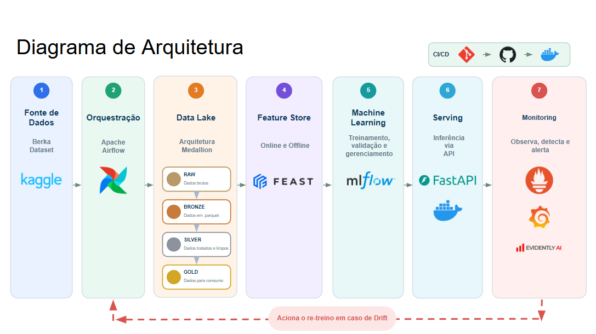
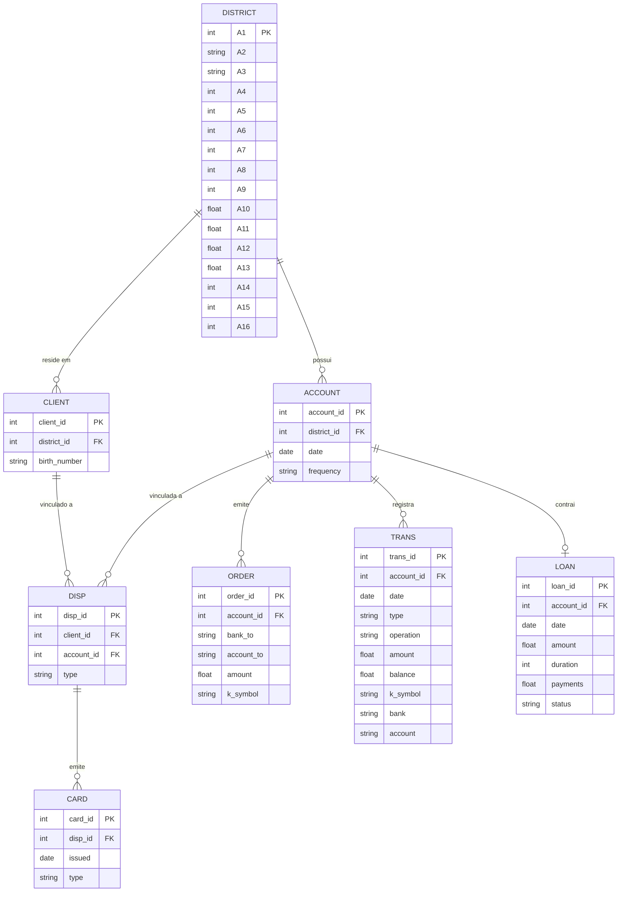
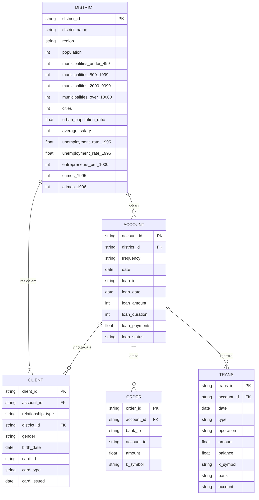

# The Bank Project

O projeto está baseado em 3 etapas.
- Extração, processamento e armazenamento dos dados utilizados;
- Geração de um modelo de ML;
- Geração de um chat conversacional;

## Arquitetura



A arquitetura-alvo do projeto segue o diagrama acima, com status
detalhado fase a fase em [ROADMAP.md](ROADMAP.md):

1. **Fonte de Dados** — [The Berka Dataset](https://www.kaggle.com/datasets/marceloventura/the-berka-dataset), via API do Kaggle.
2. **Orquestração** — Apache Airflow: DAGs para o pipeline de dados e, depois, para treino/deploy.
3. **Data Lake** — arquitetura Medallion local (raw → bronze → silver → gold).
4. **Feature Store** — Feast, online e offline, sobre a Gold.
5. **Machine Learning** — MLflow (treino, comparação, tuning e Model Registry).
6. **Serving** — API FastAPI servindo a versão `Production` do Registry, containerizada via Docker.
7. **Monitoring** — Evidently AI (drift), Prometheus + Grafana (métricas/dashboards); drift acima do limiar dispara uma nova execução da orquestração (Fase 1).

Hoje, só o bloco 1 (Fonte de Dados) e a parte de ingestão do bloco 3
(raw → bronze → silver) estão implementados — ver "Estado atual" no
ROADMAP.

## Dados

O ponto de partida deste projeto é o [The Berka Dataset](https://www.kaggle.com/datasets/marceloventura/the-berka-dataset), este conjunto de dados reune informações financeiras de um banco tcheco para o ano de 1999.\
Temos disponíveis oito tabelas, cada uma delas com o seguinte _schema_ de dados:

**`account`** (4500 registros)

| Coluna | Tipo | Descrição |
|---|---|---|
| `account_id` | int | Chave de identificação da conta. |
| `district_id` | int | Chave de identificação do distrito. |
| `date` | date | Data de criação da conta, no formato AAMMDD. |
| `frequency` | string | Frequência de emissão do extrato (`POPLATEK MESICNE`=Mensal, `POPLATEK TYDNE`=Semanal, `POPLATEK PO OBRATU`=Por transação). |

**`card`** (892 registros)

| Coluna | Tipo | Descrição |
|---|---|---|
| `card_id` | int | Chave de identificação do cartão. |
| `disp_id` | int | Chave de identificação do _disp_ (elemento que relaciona o cliente e suas contas). |
| `issued` | date | Data de emissão do cartão, no formato AAMMDD. |
| `type` | string | Tipo de cartão (`junior`, `classic` ou `gold`). |

**`client`** (5369 registros)

| Coluna | Tipo | Descrição |
|---|---|---|
| `client_id` | int | Chave de identificação do cliente. |
| `district_id` | int | Chave de identificação do distrito. |
| `birth_number` | string | Data de nascimento e sexo, nos formatos AAMMDD (homens) e AAMM+50DD (mulheres). |

**`disp`** (5369 registros)

| Coluna | Tipo | Descrição |
|---|---|---|
| `disp_id` | int | Chave de identificação do _disp_ (elemento que relaciona o cliente e suas contas). |
| `client_id` | int | Identificador do cliente. |
| `account_id` | int | Identificador da conta. |
| `type` | string | Tipo de _disp_ (`OWNER`/`DISPONENT`). |

Nota: Somente o proprietário (`OWNER`) pode emitir ordens ou realizar empréstimos.

**`district`** (77 registros)

| Coluna | Tipo | Descrição |
|---|---|---|
| `A1` | int | district_id. |
| `A2` | string | Nome do Distrito. |
| `A3` | string | Região. |
| `A4` | int | Nº de Habitantes. |
| `A5` | int | Nº de Municípios com menos de 499 habitantes. |
| `A6` | int | Nº de Municípios com 500 a 1999 habitantes. |
| `A7` | int | Nº de Municípios com 2000 a 9999 habitantes. |
| `A8` | int | Nº de Municípios com mais de 10000 habitantes. |
| `A9` | int | Nº de Cidades. |
| `A10` | float | Proporção de habitantes urbanos. |
| `A11` | float | Salário Médio. |
| `A12` | float | Taxa de desemprego em 1995. |
| `A13` | float | Taxa de desemprego em 1996. |
| `A14` | int | Nº de Empreendedores por 1000 habitantes. |
| `A15` | int | Nº de Crimes cometidos em 1995. |
| `A16` | int | Nº de Crimes cometidos em 1996. |

**`loan`** (682 registros)

| Coluna | Tipo | Descrição |
|---|---|---|
| `loan_id` | int | Chave de identificação do empréstimo. |
| `account_id` | int | Chave de identificação da conta. |
| `date` | date | Data de concessão do empréstimo, no formato AAMMDD. |
| `amount` | float | Valor do empréstimo. |
| `duration` | int | Duração do empréstimo, em meses. |
| `payments` | float | Valor do pagamento mensal. |
| `status` | string | Situação de pagamento do empréstimo (`A`=Contrato encerrado sem dívidas, `B`=Contrato encerrado com empréstimo não pago, `C`=Contrato em vigor em dia, `D`=Contrato em vigor com cliente em débito). |

**`order`** (6471 registros)

| Coluna | Tipo | Descrição |
|---|---|---|
| `order_id` | int | Chave de identificação da ordem. |
| `account_id` | int | Chave de identificação da conta emissora. |
| `bank_to` | string | Código do banco destinatário, composto por duas letras. |
| `account_to` | string | Chave de identificação da conta destinatária. |
| `amount` | float | Valor debitado da conta. |
| `k_symbol` | string | Propósito do pagamento (`POJISTNE`=Pagamento de seguro, `SIPO`=Pagamento doméstico, `LEASING`=Pagamento de leasing, `UVER`=Pagamento de empréstimo). |

**`trans`** (1.056.320 registros)

| Coluna | Tipo | Descrição |
|---|---|---|
| `trans_id` | int | Chave de identificação da transação. |
| `account_id` | int | Chave de identificação da conta. |
| `date` | date | Data da transação, no formato AAMMDD. |
| `type` | string | Tipo de transação (`PRIJEM`=Crédito, `VYDAJ`=Débito, `VYBER`=Saque). |
| `operation` | string | Modo de realização da transação (`VYBER KARTOU`=Saque com cartão, `VKLAD`=Depósito em dinheiro, `PREVOD Z UCTU`=Transferência recebida, `VYBER`=Saque em dinheiro, `PREVOD NA UCET`=Transferência enviada). |
| `amount` | float | Valor da transação. |
| `balance` | float | Saldo da conta após a transação. |
| `k_symbol` | string | Caracterização da transação (`POJISTNE`=Pagamento de seguro, `SLUZBY`=Tarifa de emissão de extrato, `UROK`=Juros, `SANKC. UROK`=Juros de penalidade por saldo negativo, `SIPO`=Pagamento doméstico, `DUCHOD`=Pensão, `UVER`=Pagamento de empréstimo). |
| `bank` | string | Código do banco parceiro, composto por duas letras (aplicável apenas a transferências). |
| `account` | string | Chave de identificação da conta parceira (aplicável apenas a transferências). |

### Camada Bronze: Dados e relacionamentos preservados

O diagrama abaixo descreve o schema original do Berka Dataset, que compõe a camada Bronze do datalake. O conjunto original possui 8 tabelas, com uma hierarquia de 4 níveis:\
`district → account/client → disp → card/loan/order/trans`



### Camada Silver: Reorganização das tabelas

Na camada Silver, optou-se por simplificar os relacionamentos entre as tabelas, consolidando `disp` e `card` como atributos de `client`. O mesmo se repete para `loan` como atributos de `account`. Já a tabela `district` tem só suas colunas renomeadas — com uma exceção: a chave `district_id` passa de `int` para `string`, para bater em tipo com as FKs `account.district_id`/`client.district_id` e permitir o join direto entre as tabelas.
O diagrama abaixo apresenta o resultado da reorganização. Observe que reduzimos de 8 para 5 tabelas, e passamos de 7 para apenas 3 relacionamentos.



**`district`** (77 registros) — colunas A1..A16 renomeadas, dados inalterados

| Coluna | Tipo | Descrição |
|---|---|---|
| `district_id` | string | Era `A1`. |
| `district_name` | string | Era `A2`. |
| `region` | string | Era `A3`. |
| `population` | int | Era `A4`. |
| `municipalities_under_499` | int | Era `A5`. |
| `municipalities_500_1999` | int | Era `A6`. |
| `municipalities_2000_9999` | int | Era `A7`. |
| `municipalities_over_10000` | int | Era `A8`. |
| `cities` | int | Era `A9`. |
| `urban_population_ratio` | float | Era `A10`. |
| `average_salary` | int | Era `A11`. |
| `unemployment_rate_1995` | float | Era `A12`. |
| `unemployment_rate_1996` | float | Era `A13`. |
| `entrepreneurs_per_1000` | int | Era `A14`. |
| `crimes_1995` | int | Era `A15`. |
| `crimes_1996` | int | Era `A16`. |

**`client`** (5369 registros; consolida `client` + `disp` + `card`)

| Coluna | Tipo | Descrição |
|---|---|---|
| `client_id` | string | Chave de identificação do cliente. |
| `account_id` | string | Chave de identificação da conta. |
| `relationship_type` | string | Papel do cliente na conta: `TITULAR` (era `OWNER`) = proprietário, único que pode emitir ordens ou contrair empréstimos; `DEPENDENTE` (era `DISPONENT`). |
| `district_id` | string | Chave de identificação do distrito de residência. |
| `gender` | string | Sexo do cliente (`M`/`F`), derivado de `birth_number`. |
| `birth_date` | date | Data de nascimento, derivada de `birth_number`. |
| `card_id` | string | Chave de identificação do cartão. |
| `card_type` | string | Tipo de cartão (nulo se sem cartão) (`junior`, `classic` ou `gold`). |
| `card_issued` | date | Data de emissão do cartão (nulo se sem cartão). |

**`account`** (4500 registros; consolida `account` + `loan`)

| Coluna | Tipo | Descrição |
|---|---|---|
| `account_id` | string | Chave de identificação da conta. |
| `district_id` | string | Chave de identificação do distrito da conta. |
| `frequency` | string | Frequência de emissão do extrato: `MENSAL` (era `POPLATEK MESICNE`), `SEMANAL` (era `POPLATEK TYDNE`), `POR TRANSACAO` (era `POPLATEK PO OBRATU`). |
| `date` | date | Data de criação da conta. |
| `loan_id` | string | Chave de identificação do empréstimo (nulo para as contas sem empréstimo). |
| `loan_date` | date | Data de concessão do empréstimo (nulo se sem empréstimo). |
| `loan_amount` | int | Valor do empréstimo (nulo se sem empréstimo). |
| `loan_duration` | int | Duração do empréstimo em meses (nulo se sem empréstimo). |
| `loan_payments` | float | Valor do pagamento mensal (nulo se sem empréstimo). |
| `loan_status` | string | Situação de pagamento do empréstimo (nulo se sem empréstimo): `ENCERRADO ADIMPLENTE` (era `A`), `ENCERRADO INADIMPLENTE` (era `B`), `ATIVO ADIMPLENTE` (era `C`), `ATIVO INADIMPLENTE` (era `D`). |

**`order`** (6471 registros) — schema idêntico ao original, só os valores de `k_symbol` são traduzidos

| Coluna | Tipo | Descrição |
|---|---|---|
| `order_id` | string | Chave de identificação da ordem. |
| `account_id` | string | Chave de identificação da conta emissora. |
| `bank_to` | string | Código do banco destinatário, composto por duas letras. |
| `account_to` | string | Chave de identificação da conta destinatária. |
| `amount` | float | Valor debitado da conta. |
| `k_symbol` | string | Propósito do pagamento: `SEGURO` (era `POJISTNE`), `CONTAS DOMESTICAS` (era `SIPO`), `ARRENDAMENTO` (era `LEASING`), `PAGAMENTO DE EMPRESTIMO` (era `UVER`). |

**`trans`** (1.056.320 registros) — schema idêntico ao original, só os valores de `type`/`operation`/`k_symbol` são traduzidos

| Coluna | Tipo | Descrição |
|---|---|---|
| `trans_id` | string | Chave de identificação da transação. |
| `account_id` | string | Chave de identificação da conta. |
| `date` | date | Data da transação. |
| `type` | string | Tipo de transação: `CREDITO` (era `PRIJEM`), `DEBITO` (era `VYDAJ`), `SAQUE` (era `VYBER` — variação legada de `DEBITO` para um subconjunto de transações). |
| `operation` | string | Modo de realização da transação: `SAQUE NO CARTAO` (era `VYBER KARTOU`), `DEPOSITO EM ESPECIE` (era `VKLAD`), `TRANSFERENCIA RECEBIDA` (era `PREVOD Z UCTU`), `SAQUE EM ESPECIE` (era `VYBER`), `TRANSFERENCIA ENVIADA` (era `PREVOD NA UCET`). |
| `amount` | float | Valor da transação. |
| `balance` | float | Saldo da conta após a transação. |
| `k_symbol` | string | Caracterização da transação: `SEGURO` (era `POJISTNE`), `TARIFA DE SERVICO` (era `SLUZBY`), `JUROS CREDITADOS` (era `UROK`), `JUROS PUNITIVOS` (era `SANKC. UROK`), `CONTAS DOMESTICAS` (era `SIPO`), `APOSENTADORIA` (era `DUCHOD`), `PAGAMENTO DE EMPRESTIMO` (era `UVER`). |
| `bank` | string | Código do banco parceiro, composto por duas letras (aplicável apenas a transferências). |
| `account` | string | Chave de identificação da conta parceira (aplicável apenas a transferências). |

## Datalake local

Para este projeto foi provisionado um datalake baseado na arquitetura Medallion, hospedado numa infraestrutura local.
- Camada raw: contém os arquivos brutos no formato `.csv` do [The Berka Dataset](https://www.kaggle.com/datasets/marceloventura/the-berka-dataset).
- Camada bronze: Cópia fiel dos arquivos originais, no formato `.parquet`.
- Camada silver: dados originais do conjunto devidamente tratados e reorganizados (ver [Reorganização na Silver](#camada-silver-reorganização-das-tabelas)). O tratamento inclui a tipagem correta de cada coluna, o preenchimento dos valores nulos, datas parseadas e valores categóricos traduzidos para português.
- Camada gold: feature store pronta para ML, servida via Feast (online + offline) — **ainda não implementada**, ver ROADMAP.md, Fase 2.

### Estrutura gerada

```
datalake/
├── raw/                  # arquivos brutos, sem alterações
├── bronze/               # arquivos da camada raw no formato .parquet.
└── silver/                # dados devidamente tipados, nulos tratados, datas parseadas.
```

`gold/` (feature store Feast) ainda não existe — ver ROADMAP.md, Fase 2.

```
notebooks/
└── eda_silver.ipynb        # EDA da Silver (todas as 5 tabelas).
```

```
tests/
└── data/features/
    └── test_bronze_to_silver.py   # merges 1:1 da reorganização Silver.
```

### Datalake Setup

```bash
# 1. Instalação (Poetry cria e gerencia o .venv)
poetry install

# 2. Credenciais da Kaggle API
##    Copie .env.example para .env e preencha KAGGLE_USERNAME/KAGGLE_KEY, ou:
##    Gere o token em https://www.kaggle.com/settings/api > Generate New Token
##    Alternativas também suportadas pelo script:
##      - variável de ambiente KAGGLE_API_TOKEN=<token>
##      - formato legacy ~/.kaggle/kaggle.json com {"username":..., "key":...}
mkdir -p ~/.kaggle
mv ~/Downloads/token ~/.kaggle/access_token   # Cole apenas o valor do token no arquivo
chmod 600 ~/.kaggle/access_token

# 3. Setup  inicial (Criação dos diretórios e dowload dos arquivos brutos)
poetry run python -m src.data.ingestion.datalake_setup

# 4. Ingestão e processamento I (raw -> bronze)
poetry run python -m src.data.ingestion.raw_to_bronze

# 5. Ingestão e processamento II (bronze -> silver)
poetry run python -m src.data.features.bronze_to_silver
```

O restante do pipeline (Gold/Feast → treino/MLflow → serving → monitoramento) ainda não existe — ver ROADMAP.md para o status fase a fase.

### Testes

```bash
poetry run pytest
```

## O que os módulos fazem

Padrão de código e documentação (docstrings, comentários, o que vive em
`src/common.py` vs. em cada módulo) documentado em [CONTRIBUTING.md](CONTRIBUTING.md).
Estrutura de diretórios de `src/` (o que vive em cada pasta) documentada
no CLAUDE.md, seção "Estrutura do projeto".

### `datalake_setup.py` (Raw)

1. Cria (de forma idempotente) as pastas da arquitetura Medallion.
2. Valida se as credenciais da Kaggle API estão configuradas.
3. Baixa o dataset `marceloventura/the-berka-dataset` (.zip).
4. Extrai o `.zip` em uma pasta temporária.
5. Move todos os `.csv` extraídos para `datalake/raw/`, sem alterar o
   conteúdo (via `shutil.move`).
6. Remove o `.zip` e a pasta temporária de extração.

### `raw_to_bronze.py` (Bronze)

1. Lê todos os `.csv` de `datalake/raw/` (delimitador `;`).
2. Converte cada um para `.parquet` (pandas + pyarrow) mantendo o mesmo
   nome (ex.: `client.csv` -> `client.parquet`).
3. Cópia 1:1: todas as colunas são lidas como `dtype=str`, sem inferência
   de tipo nem interpretação de valores nulos (`keep_default_na=False`),
   garantindo que a Bronze seja fiel byte-a-byte à Raw, só que em formato
   colunar.
4. Registra no log o número de linhas e colunas de cada arquivo
   convertido; falhas em um arquivo não interrompem os demais.

### `bronze_to_silver.py` (Silver)

1. Lê cada `.parquet` da Bronze (tudo `string`) e normaliza `""`, `" "` e
   `'?'` (marcador de nulo usado em `district.A12`/`A15`) para `NaN`.
2. Classifica colunas por nome/conteúdo: `id`, `*_id`, `*_to`, e
   `trans.account`/`district.A1` (overrides explícitos, pois não seguem a
   convenção de sufixo) permanecem `string`; `date` e `card.issued`
   (YYMMDD, também um override explícito) viram `datetime` (assume século
   19xx); demais colunas 100% numéricas viram `int` ou `float`; o restante
   permanece texto. O override de `district.A1` garante que a chave bata
   em tipo com as FKs `account.district_id`/`client.district_id` (ambas
   `string`), permitindo o join direto entre as tabelas.
3. Trata nulos: mediana para colunas numéricas, `'DESCONHECIDO'` para
   texto/categóricas (inclui as colunas de ID).
4. Regra específica da tabela `client`: decompõe `birth_number` em
   `gender` ('M'/'F') e `birth_date` (`datetime`), removendo a coluna
   original.
5. Traduz/adapta para português brasileiro os valores categóricos
   originalmente em tcheco (`CATEGORICAL_TRANSLATIONS`): ex.
   `account.frequency` (`POPLATEK MESICNE` -> `MENSAL`), `disp.type`
   (`OWNER` -> `TITULAR`), `trans.type` (`PRIJEM` -> `CREDITO`),
   `trans.operation`, `trans.k_symbol`/`order.k_symbol` e `loan.status`
   (códigos A-D adaptados para rótulos descritivos, ex. `ATIVO ADIMPLENTE`).
6. Com as 8 tabelas tratadas, consolida o schema (ver
   [Reorganização na Silver](#camada-silver-reorganização-das-tabelas)):
   `disp` + `card` -> `client`; `loan` -> `account` (merges 1:1, via
   `pd.merge(..., validate="one_to_one")` — o próprio pandas barra a
   gravação caso a premissa de cardinalidade deixe de valer no futuro);
   `district` só tem as colunas A1..A16 renomeadas.
7. Grava o resultado em `datalake/silver/` (5 tabelas: `district`,
   `client`, `account`, `order`, `trans`), removendo arquivos de uma
   execução anterior ao schema reorganizado
   (`disp.parquet`/`card.parquet`/`loan.parquet`), com logs detalhados
   por tabela (classificação de colunas, nulos preenchidos e valores
   traduzidos).

Todo o progresso é registrado via `logging` (nível INFO).

## Notebook de EDA

`notebooks/eda_silver.ipynb` cobre as 5 tabelas da Silver em profundidade,
com a mesma estrutura para cada uma: (1) dicionário de dados, (2) volume/
tipo/formato, (3) indicadores e chaves primárias/estrangeiras, (4) nulos,
duplicatas e valores fora do padrão (outliers por IQR, taxa do marcador
`'DESCONHECIDO'`), (5) gráficos (seaborn — dispersão, histograma, barra,
boxplot, heatmap de correlação, série temporal), e (6) insights voltados
para a modelagem da Gold. Os gráficos usam uma paleta categórica fixa (8
cores, nunca redistribuída por rank) e rampas sequencial/divergente de um
único matiz cada, para leitura consistente entre os gráficos. Para rodar:

```bash
source .venv/bin/activate
jupyter nbconvert --to notebook --execute --inplace notebooks/eda_silver.ipynb
# ou abrir interativamente:
jupyter lab notebooks/eda_silver.ipynb
```
