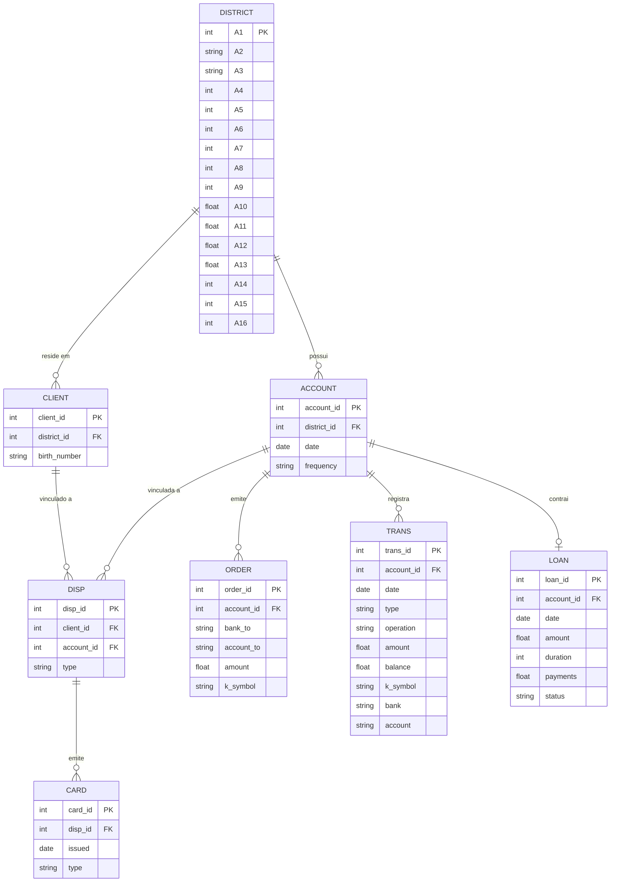
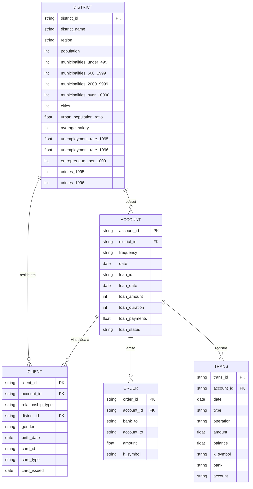

# The Bank Project

O projeto está baseado em 3 etapas.
- Extração, processamento, enriquecimento e armazenamento dos dados utilizados;
- Geração de um modelo de ML;
- Geração de um chat conversacional;

## Dados

O ponto de partida deste projeto é o [The Berka Dataset](https://www.kaggle.com/datasets/marceloventura/the-berka-dataset), este conjunto de dados reune informações financeiras de um banco tcheco para o ano de 1999.\
Temos disponíveis oito tabelas, cada uma delas com o seguinte _schema_ de dados:

- _account_ (4500 registros):
   - account_id: Chave de identificação da conta;
   - district_id Chave de identificação do distrito;
   - date: Data de criação da conta, no formato AAMMDD;
   - frequency: Frequência de emissão do extrato
   ```
   {
      "POPLATEK MESICNE": "Mensal",
      "POPLATEK TYDNE": "Semanal",
      "POPLATEK PO OBRATU": "Por transação"
   }
   ```
- _card_ (892 registros):
   - card_id: Chave de identificação do cartão;
   - disp_id: Chave de identificação do _disp_ (elemento que relaciona o cliente e suas contas);
   - issued: Data de emissão do cartão, no formato: AAMMDD
   - type: Tipo de cartão:
   ```
      'junior', 'classic' e 'gold'
   ```
- _clients_ (5369 registros):
   - client_id: Chave de identificação do cliente;
   - district_id: Chave de identificação do distrito;
   - birth_number Data de nascimento e sexo, nos formatos AAMMDD (para homens) e AAMM+50DD (para mulheres)
- _disp_ (5369 registros):
   - disp_id: Chave de identificação do _disp_ (elemento que relaciona o cliente e suas contas);
   - client_id: Identificador do cliente;
   - account_id: Identificador da conta;
   - type: Tipo de _disp_ 
   ```
      Nota: Somente o proprietário pode emitir ordens  ou realizar empréstimos.
   ```
- _district_ (77 registros):
   - A1: district_id;
   - A2: Nome do Distrito;
   - A3: Região;
   - A4: Nº de Habitantes;
   - A5: Nº de Municípios com menos de 499 habitantes;
   - A6: Nº de Municípios com 500 a 1999 habitantes;
   - A7: Nº de Municípios com 2000 a 9999 habitantes;
   - A8: Nº de Municípios com mais de 10000 habitantes;
   - A9: Nº de Cidades;
   - A10: Proporção de habitantes urbanos;
   - A11: Salário Médio;
   - A12: Taxa de desemprego em 1995;
   - A13: Taxa de desemprego em 1996;
   - A14: Nº de Empreendedores por 1000 habitantes;
   - A15: Nº de Crimes cometidos em 1995;
   - A16: Nº de Crimes cometidos em 1996;

- _loan_ (682 registros):
   - loan_id: Chave de identificação do empréstimo;
   - account_id: Chave de identificação da conta;
   - date: Data de concessão do empréstimo, no formato AAMMDD;
   - amount: Valor do empréstimo;
   - duration: Duração do empréstimo, em meses;
   - payments: Valor do pagamento mensal;
   - status: Situação de pagamento do empréstimo
   ```
   {
      "A": "Contrato encerrado, sem dívidas",
      "B": "Contrato encerrado, empréstimo não pago",
      "C": "Contrato em vigor, em dia",
      "D": "Contrato em vigor, cliente em débito"
   }
   ```
- _order_ (6471 registros):
   - order_id: Chave de identificação da ordem;
   - account_id: Chave de identificação da conta emissora;
   - bank_to: Código do banco destinatário, composto por duas letras;
   - account_to: Chave de identificação da conta destinatária;
   - amount: Valor debitado da conta;
   - k_symbol: Propósito do pagamento
   ```
   {
      "POJISTNE": "Pagamento de seguro",
      "SIPO": "Pagamento doméstico",
      "LEASING": "Pagamento de leasing",
      "UVER": "Pagamento de empréstimo"
   }
   ```
- _trans_ (1.056.320 registros):
   - trans_id: Chave de identificação da transação;
   - account_id: Chave de identificação da conta;
   - date: Data da transação, no formato AAMMDD;
   - type: Tipo de transação
   ```
   {
      "PRIJEM": "Crédito",
      "VYDAJ": "Débito",
      "VYBER": "Saque (variação legada de VYDAJ para um subconjunto de transações)"
   }
   ```
   - operation: Modo de realização da transação
   ```
   {
      "VYBER KARTOU": "Saque com cartão",
      "VKLAD": "Depósito em dinheiro",
      "PREVOD Z UCTU": "Transferência recebida (de outro banco)",
      "VYBER": "Saque em dinheiro",
      "PREVOD NA UCET": "Transferência enviada (para outro banco)"
   }
   ```
   - amount: Valor da transação;
   - balance: Saldo da conta após a transação;
   - k_symbol: Caracterização da transação
   ```
   {
      "POJISTNE": "Pagamento de seguro",
      "SLUZBY": "Tarifa de emissão de extrato",
      "UROK": "Juros",
      "SANKC. UROK": "Juros de penalidade por saldo negativo",
      "SIPO": "Pagamento doméstico",
      "DUCHOD": "Pensão",
      "UVER": "Pagamento de empréstimo"
   }
   ```
   - bank: Código do banco parceiro, composto por duas letras (aplicável apenas a transferências);
   - account: Chave de identificação da conta parceira (aplicável apenas a transferências);

### Diagrama Entidade-Relacionamento (dataset de origem)

O diagrama abaixo descreve o schema original do Berka Dataset (8 tabelas),
tal como chega na camada Raw/Bronze. A camada Silver reorganiza esse
schema — ver [Reorganização na Silver](#reorganização-na-silver)
mais abaixo.



### Reorganização na Silver

O schema de origem tem 8 tabelas e uma hierarquia de 4 níveis
(`district → account/client → disp → card/loan/order/trans`). Para
simplificar os relacionamentos e reduzir os joins necessários nas etapas
seguintes (modelagem) — a Silver consolida `disp` + `card` dentro de
`client`, e `loan` dentro de `account`.
`district` permanece como tabela dimensão separada (só as colunas
A1..A16 foram renomeadas), pois um join simples já resolve a relação sem
introduzir ambiguidade.

Os três merges usados na consolidação são **1:1, sem perda de dado** —
validado contra os dados reais antes da implementação:
- todo `client` tem exatamente 1 `disp` (nenhum cliente em mais de uma
  conta, nenhuma conta com mais de 1 titular ou mais de 1 dependente, e
  nunca o mesmo `client_id` como titular e dependente da mesma conta);
- todo `card` pertence a um `disp` do tipo `TITULAR` único (nenhum
  dependente tem cartão, nenhum titular tem mais de 1 cartão);
- toda `account` tem no máximo 1 `loan`.

O resultado é 5 tabelas em vez de 8, com apenas 3 relacionamentos em vez
de 7:



- _district_ (77 registros) — colunas A1..A16 renomeadas, dados inalterados:
   - district_id (era A1), district_name (A2), region (A3), population (A4),
     municipalities_under_499 (A5), municipalities_500_1999 (A6),
     municipalities_2000_9999 (A7), municipalities_over_10000 (A8),
     cities (A9), urban_population_ratio (A10), average_salary (A11),
     unemployment_rate_1995 (A12), unemployment_rate_1996 (A13),
     entrepreneurs_per_1000 (A14), crimes_1995 (A15), crimes_1996 (A16);
- _client_ (5369 registros; consolida _client_ + _disp_ + _card_):
   - client_id: Chave de identificação do cliente;
   - account_id: Chave de identificação da conta (todo cliente pertence a exatamente 1 conta);
   - relationship_type: Papel do cliente na conta
   ```
   {
      "TITULAR": "Proprietário — único que pode emitir ordens ou contrair empréstimos",
      "DEPENDENTE": "Dependente"
   }
   ```
   - district_id: Chave de identificação do distrito de residência;
   - gender: Sexo do cliente ('M'/'F'), derivado de `birth_number`;
   - birth_date: Data de nascimento, derivada de `birth_number`;
   - card_id: Chave de identificação do cartão (nulo para os 4477 clientes sem cartão — só titular pode ter);
   - card_type: Tipo de cartão (nulo se sem cartão)
   ```
      'junior', 'classic' e 'gold'
   ```
   - card_issued: Data de emissão do cartão (nulo se sem cartão);
- _account_ (4500 registros; consolida _account_ + _loan_):
   - account_id: Chave de identificação da conta;
   - district_id: Chave de identificação do distrito da conta;
   - frequency: Frequência de emissão do extrato
   ```
   {
      "POPLATEK MESICNE": "Mensal",
      "POPLATEK TYDNE": "Semanal",
      "POPLATEK PO OBRATU": "Por transação"
   }
   ```
   - date: Data de criação da conta;
   - loan_id: Chave de identificação do empréstimo (nulo para as 3818 contas sem empréstimo);
   - loan_date: Data de concessão do empréstimo (nulo se sem empréstimo);
   - loan_amount: Valor do empréstimo (nulo se sem empréstimo);
   - loan_duration: Duração do empréstimo em meses (nulo se sem empréstimo);
   - loan_payments: Valor do pagamento mensal (nulo se sem empréstimo);
   - loan_status: Situação de pagamento do empréstimo (nulo se sem empréstimo)
   ```
   {
      "A": "Contrato encerrado, sem dívidas",
      "B": "Contrato encerrado, empréstimo não pago",
      "C": "Contrato em vigor, em dia",
      "D": "Contrato em vigor, cliente em débito"
   }
   ```
- _order_ e _trans_: inalteradas (ver schema de origem acima).

### Modelagem da Gold

Objetivo final do projeto: treinar modelos de ML. Entre 3 propostas de
modelagem avaliadas para a camada Gold — (1) risco de crédito
(classificação de inadimplência de empréstimo, grão=loan), (2) previsão
de fluxo de caixa mensal por conta (regressão, grão=conta×mês), (3)
segmentação comportamental de clientes (não supervisionado) — foi
escolhida a **Proposta 2**.

**Grão:** 1 linha por `account_id` × `ano_mes` (chave composta).
**Target:** `target_soma_entradas_proximo_mes` — soma das entradas
(`trans.type == 'CREDITO'`) do mês seguinte, dentro da mesma conta.

A tabela combina as 5 tabelas da Silver: agregados mensais de
`trans` (o núcleo comportamental), atributos de `account` (idade da
conta, frequência, termos do empréstimo), `client` (idade/sexo do
titular, presença de dependente), `district` (contexto socioeconômico,
denormalizado via `account.district_id`) e `order` (soma das ordens
permanentes da conta). Ver `gold_features.py` mais abaixo para o schema
completo, coluna a coluna.

**Duas decisões deliberadas para evitar vazamento de informação do
futuro:**
- `loan_status` (desfecho final do empréstimo) **não é usada como
  feature** — é determinada possivelmente depois do mês sendo modelado;
  usá-la em todas as linhas do empréstimo vazaria o resultado final para
  trás na série. Em vez disso, cada linha carrega só `loan_ativo_no_mes`
  (o empréstimo já existia e ainda não tinha terminado naquele mês — um
  fato conhecido na época) e `loan_payments` (valor fixo do pagamento,
  conhecido desde a concessão). Mesma lógica para `card_ativo_no_mes`.
- Os dados sintéticos (etapa removida do projeto — ver histórico) não
  entram na Gold: a tentativa de sintetizar `trans` via bootstrap de
  linha real + jitter não agrega informação genuinamente nova (é a
  mesma observação real, perturbada) e introduz risco de vazamento entre
  treino e teste por quase-duplicação. A Gold é construída só com dados
  reais.

**Preenchimento de gaps mensais:** cada conta é reindexada para um
calendário contínuo entre o primeiro e o último mês com qualquer
transação (não só as de crédito). Meses sem transação viram
`soma_entradas_mes_atual`/`soma_saidas_mes_atual`/`n_transacoes_mes = 0`;
`saldo_fim_mes` é propagado do último mês observado. Sem isso, a janela
móvel e o `shift` do target operariam sobre *linhas* em vez de meses de
calendário.

**Resultado real:** 185.326 linhas conta-mês na janela completa (269
delas preenchidas por gap-fill) → **171.826 linhas finais**, após remover
as bordas de cada conta (início: sem janela móvel completa; fim: sem mês
seguinte para o target).

### Pipeline de treinamento do modelo

Três propostas de pipeline foram avaliadas: **(A)** regressão linear
regularizada (Ridge) com holdout temporal simples; **(B)** gradient
boosting (XGBoost) com validação walk-forward; **(C)** modelagem
sequencial por conta (ex.: GRU/LSTM sobre a série mensal de cada conta).
**Escolhida: Proposta B**, com a Proposta A treinada em paralelo como
baseline de comparação (nunca reportar um modelo mais complexo sem uma
baseline simples provando que ele agrega valor). A Proposta C foi
descartada: contas têm histórico curto (mediana bem abaixo do máximo de
69 meses), exigiria uma dependência pesada nunca usada no projeto
(`torch`/`tensorflow`), e contornaria o trabalho de engenharia de
features já feito na Gold.

**Validação — sempre walk-forward, nunca split aleatório de linhas:** o
problema é forecasting em painel (várias contas, cada uma com sua própria
série mensal) — um split aleatório vazaria informação entre meses
vizinhos da mesma conta. `train_model.py` usa:
- **4 folds walk-forward** (janela expansiva): a cada fold, o treino é
  tudo até um corte de data e a validação são os 3 meses seguintes — a
  janela de treino só cresce, nunca usa dado do futuro.
- **1 holdout final**: os últimos 3 meses da base (1998-09 a 1998-11),
  nunca tocados até a avaliação final — simula a implantação real.

**Transformação:** o target e as features monetárias (fortemente
assimétricas — ver `notebooks/eda_silver.ipynb`) recebem `signed_log1p`
(`sign(x) * log1p(|x|)` — generaliza `log1p` para aceitar `saldo_fim_mes`
negativo) antes do treino; as métricas são sempre revertidas para a
escala original (moeda) antes de calcular MAE/RMSE/R². `district_id` não
entra como feature — é um identificador de alta cardinalidade cuja
informação já está denormalizada nas colunas socioeconômicas da Gold.

**Resultado (holdout final, 1998-09 a 1998-11):**

| Modelo | MAE | RMSE | R² |
|---|---|---|---|
| Ridge (baseline) | 7.563 | 17.295 | 0,289 |
| **XGBoost** | **6.057** | 17.595 | 0,265 |

O XGBoost erra ~20% menos em média (MAE) que o Ridge — confirma que a
Proposta B agrega valor sobre o baseline linear. Mas é um resultado misto,
não uma vitória limpa: o Ridge tem RMSE e R² levemente melhores, ou seja,
o XGBoost acerta melhor o caso típico mas comete alguns erros grandes que
penalizam mais o RMSE (que pune erro ao quadrado) do que o MAE. R² em
torno de 0,25-0,29 nos dois modelos indica que boa parte da variação nas
entradas do mês seguinte não é explicada pelas features atuais — esperado
para fluxo de caixa pessoal (inerentemente ruidoso), mas deixa espaço
real para iteração futura (ajuste de hiperparâmetros, mais features).
`soma_entradas_mes_atual`, `media_entradas_ultimos_3_meses` e
`n_transacoes_mes` são as features mais importantes no XGBoost.

**Versionamento e gestão de artefatos — MLflow:** cada execução de
`train_model.py` registra tudo no MLflow (tracking store local em
SQLite, sem servidor — ver seção do script mais abaixo): uma run pai
(`train_model`, parâmetros gerais + resumo do walk-forward) com runs
filhas aninhadas por fold e uma `holdout_final`, onde os 2 modelos finais
são logados **e registrados** no Model Registry
(`inflow-forecast-ridge`, `inflow-forecast-xgboost`) — cada execução cria
uma nova versão, nada é sobrescrito, e cada versão carrega a métrica de
holdout na própria descrição. Para explorar:
`mlflow ui --backend-store-uri sqlite:///datalake/gold/models/mlflow.db`.

Para este projeto foi provisionado um datalake baseado na arquitetura Medallion, hospedado numa infraestrutura local. 
- Camada raw: contém os arquivos brutos no formato `.csv` do [The Berka Dataset](https://www.kaggle.com/datasets/marceloventura/the-berka-dataset). 
- Camada bronze: Cópia fiel dos arquivos originais, no formato `.parquet`.
- Camada silver: dados originais do conjunto devidamente tratados e reorganizados (ver [Reorganização na Silver](#reorganização-na-silver)). O tratamento inclui a tipagem correta de cada coluna, o preenchimento dos valores nulos, datas parseadas e valores categóricos traduzidos para português.
- Camada gold: `account_monthly_features`, feature store pronta para ML (ver [Modelagem da Gold](#modelagem-da-gold)).

### Estrutura gerada

```
datalake/
├── raw/                  # arquivos brutos, sem alterações
├── bronze/               # arquivos da camada raw no formato .parquet.
├── silver/                # dados devidamente tipados, nulos tratados, datas parseadas.
└── gold/
    ├── account_monthly_features.parquet   # feature store (grão: conta x mês).
    └── models/
        ├── mlflow.db                             # tracking store do MLflow (SQLite).
        ├── mlruns/                                # artefatos do MLflow (modelos versionados, por run).
        ├── cv_metrics_walk_forward.csv           # métricas por fold (média +/- desvio-padrão).
        ├── holdout_metrics.csv                   # métricas no holdout final.
        └── xgboost_feature_importances.csv       # importância nativa das features.
```

```
notebooks/
└── eda_silver.ipynb        # EDA da Silver (todas as 5 tabelas).
```

### Datalake Setup

```bash
# 1. Criação do ambiente virtual
python3 -m venv .datalake-venv
source .datalake-venv/bin/activate

# 2. Instação de dependências
pip install -r requirements.txt

# 3. Credenciais da Kaggle API 
##    Gere o token em https://www.kaggle.com/settings/api > Generate New Token
##    Alternativas também suportadas pelo script:
##      - variável de ambiente KAGGLE_API_TOKEN=<token>
##      - formato legacy ~/.kaggle/kaggle.json com {"username":..., "key":...}
mkdir -p ~/.kaggle
mv ~/Downloads/token ~/.kaggle/access_token   # Cole apenas o valor do token no arquivo
chmod 600 ~/.kaggle/access_token

# 4. Setup  inicial (Criação dos diretórios e dowload dos arquivos brutos)
python src/scripts/datalake_setup.py

# 5. Ingestão e processamento I (raw -> bronze)
python src/scripts/raw_to_bronze.py

# 6. Ingestão e processamento II (bronze -> silver)
python src/scripts/bronze_to_silver.py

# 7. Feature store para ML (silver -> gold)
python src/scripts/gold_features.py

# 8. Treino e validação do modelo (gold -> gold/models)
python src/scripts/train_model.py
```

## O que os scripts fazem

Padrão de código e documentação (docstrings, comentários, o que vive em
`_common.py` vs. em cada script) documentado em [CONTRIBUTING.md](CONTRIBUTING.md).

### `datalake_setup.py` (Raw)

1. Cria (de forma idempotente) as pastas da arquitetura Medallion.
2. Valida se as credenciais da Kaggle API estão configuradas.
3. Baixa o dataset `marceloventura/the-berka-dataset` (.zip).
4. Extrai o `.zip` em uma pasta temporária.
5. Move todos os `.csv` extraídos para `datalake/raw/`, sem alterar o
   conteúdo (via `shutil.move`).
6. Remove o `.zip` e a pasta temporária de extração.

### `raw_to_bronze.py` (Bronze)

1. Lê todos os `.csv` de `datalake/raw/` (delimitador `;`).
2. Converte cada um para `.parquet` (pandas + pyarrow) mantendo o mesmo
   nome (ex.: `client.csv` -> `client.parquet`).
3. Cópia 1:1: todas as colunas são lidas como `dtype=str`, sem inferência
   de tipo nem interpretação de valores nulos (`keep_default_na=False`),
   garantindo que a Bronze seja fiel byte-a-byte à Raw, só que em formato
   colunar.
4. Registra no log o número de linhas e colunas de cada arquivo
   convertido; falhas em um arquivo não interrompem os demais.

### `bronze_to_silver.py` (Silver)

1. Lê cada `.parquet` da Bronze (tudo `string`) e normaliza `""`, `" "` e
   `'?'` (marcador de nulo usado em `district.A12`/`A15`) para `NaN`.
2. Classifica colunas por nome/conteúdo: `id`, `*_id`, `*_to`, e
   `trans.account`/`district.A1` (overrides explícitos, pois não seguem a
   convenção de sufixo) permanecem `string`; `date` e `card.issued`
   (YYMMDD, também um override explícito) viram `datetime` (assume século
   19xx); demais colunas 100% numéricas viram `int` ou `float`; o restante
   permanece texto. O override de `district.A1` garante que a chave bata
   em tipo com as FKs `account.district_id`/`client.district_id` (ambas
   `string`), permitindo o join direto entre as tabelas.
3. Trata nulos: mediana para colunas numéricas, `'DESCONHECIDO'` para
   texto/categóricas (inclui as colunas de ID).
4. Regra específica da tabela `client`: decompõe `birth_number` em
   `gender` ('M'/'F') e `birth_date` (`datetime`), removendo a coluna
   original.
5. Traduz/adapta para português brasileiro os valores categóricos
   originalmente em tcheco (`CATEGORICAL_TRANSLATIONS`): ex.
   `account.frequency` (`POPLATEK MESICNE` -> `MENSAL`), `disp.type`
   (`OWNER` -> `TITULAR`), `trans.type` (`PRIJEM` -> `CREDITO`),
   `trans.operation`, `trans.k_symbol`/`order.k_symbol` e `loan.status`
   (códigos A-D adaptados para rótulos descritivos, ex. `ATIVO ADIMPLENTE`).
6. Com as 8 tabelas tratadas, consolida o schema (ver
   [Reorganização na Silver](#reorganização-na-silver)):
   `disp` + `card` -> `client`; `loan` -> `account` (merges 1:1, via
   `pd.merge(..., validate="one_to_one")` — o próprio pandas barra a
   gravação caso a premissa de cardinalidade deixe de valer no futuro);
   `district` só tem as colunas A1..A16 renomeadas.
7. Grava o resultado em `datalake/silver/` (5 tabelas: `district`,
   `client`, `account`, `order`, `trans`), removendo arquivos de uma
   execução anterior ao schema reorganizado
   (`disp.parquet`/`card.parquet`/`loan.parquet`), com logs detalhados
   por tabela (classificação de colunas, nulos preenchidos e valores
   traduzidos).

Todo o progresso é registrado via `logging` (nível INFO).

### `gold_features.py` (Gold)

Ver [Modelagem da Gold](#modelagem-da-gold) para o racional completo do
grão, do target e das decisões de design (por que `loan_status` não é
usada, por que os dados sintéticos ficam de fora).

1. Lê as 5 tabelas da Silver.
2. Monta as features estáticas por conta: `district` denormalizada (via
   `account.district_id`), sexo/idade do titular, presença de
   dependente, soma das ordens permanentes da conta.
3. Agrega `trans` por conta e mês: soma de entradas (`type == 'CREDITO'`)
   e saídas (`type` em `{DEBITO, SAQUE}`), saldo do fim do mês (última
   transação), nº de transações.
4. Preenche os gaps mensais: reindexa cada conta para um calendário
   contínuo entre o primeiro e o último mês com qualquer transação
   (entradas/saídas/contagem viram 0; saldo é propagado do último mês
   observado).
5. Junta as features estáticas e deriva as dependentes do mês: idade da
   conta, idade do titular, `loan_ativo_no_mes`/`loan_payments` e
   `card_ativo_no_mes` (só presença, nunca o desfecho final — evita
   vazamento), mês do ano.
6. Calcula as features de janela móvel de 3 meses
   (`media_entradas_ultimos_3_meses`, `desvio_padrao_entradas_ultimos_3_meses`,
   `media_saidas_ultimos_3_meses`) e o target
   (`target_soma_entradas_proximo_mes`, `shift(-1)` dentro do grupo da
   conta).
7. Remove as linhas de borda (sem janela completa ou sem mês seguinte) e
   grava `datalake/gold/account_monthly_features.parquet`, com chave
   composta `account_id` + `ano_mes`.

Todo o progresso é registrado via `logging` (nível INFO).

### `train_model.py` (Gold -> Gold/models)

Ver [Pipeline de treinamento do modelo](#pipeline-de-treinamento-do-modelo)
para o racional completo (as 3 propostas avaliadas, a escolha, e os
resultados).

1. Aponta o MLflow para o tracking store local (SQLite,
   `datalake/gold/models/mlflow.db`; artefatos em
   `datalake/gold/models/mlruns/`) e abre a run pai `train_model`.
2. Lê a Gold e adiciona `mes_sin`/`mes_cos` (codificação cíclica do mês,
   usada só pelo Ridge).
3. Monta os 4 folds de validação walk-forward (janela expansiva, 3 meses
   de validação cada) mais o holdout final (últimos 3 meses).
4. Em cada fold (run filha `fold_N`, aninhada): treina `Ridge` (pipeline
   com imputação, `signed_log1p` nas colunas monetárias, escala e
   one-hot) e `XGBoost` (colunas categóricas como código inteiro fixo —
   não dtype `category` nativo, que não sobrevive ao round-trip JSON de
   serving do MLflow; sem imputação — `NaN` de `loan_payments` é nativo)
   no treino do fold; avalia (MAE/RMSE/R², sempre na escala original) na
   validação do fold; loga parâmetros e métricas de ambos os modelos na
   run do fold.
5. Loga na run pai o resumo agregado (média/desvio-padrão entre os 4
   folds) e o CSV `cv_metrics_walk_forward.csv` como artefato.
6. Repete o treino+avaliação uma última vez no holdout final (run filha
   `holdout_final`: treino = todo o pool de CV; validação = os últimos 3
   meses, nunca vistos até aqui) — loga métricas, `holdout_metrics.csv` e
   `xgboost_feature_importances.csv` como artefatos.
7. **Loga e registra** os 2 modelos finais no Model Registry
   (`inflow-forecast-ridge`, `inflow-forecast-xgboost`, com assinatura de
   entrada/saída inferida do exemplo) — cada execução cria uma nova
   versão; a descrição de cada versão registrada carrega as métricas de
   holdout daquela execução.

Todo o progresso é registrado via `logging` (nível INFO).

## Notebook de EDA

`notebooks/eda_silver.ipynb` cobre as 5 tabelas da Silver em profundidade,
com a mesma estrutura para cada uma: (1) dicionário de dados, (2) volume/
tipo/formato, (3) indicadores e chaves primárias/estrangeiras, (4) nulos,
duplicatas e valores fora do padrão (outliers por IQR, taxa do marcador
`'DESCONHECIDO'`), (5) gráficos (seaborn — dispersão, histograma, barra,
boxplot, heatmap de correlação, série temporal), e (6) insights voltados
para a modelagem da Gold. Os gráficos usam uma paleta categórica fixa (8
cores, nunca redistribuída por rank) e rampas sequencial/divergente de um
único matiz cada, para leitura consistente entre os gráficos. Para rodar:

```bash
source .venv/bin/activate
jupyter nbconvert --to notebook --execute --inplace notebooks/eda_silver.ipynb
# ou abrir interativamente:
jupyter lab notebooks/eda_silver.ipynb
```
