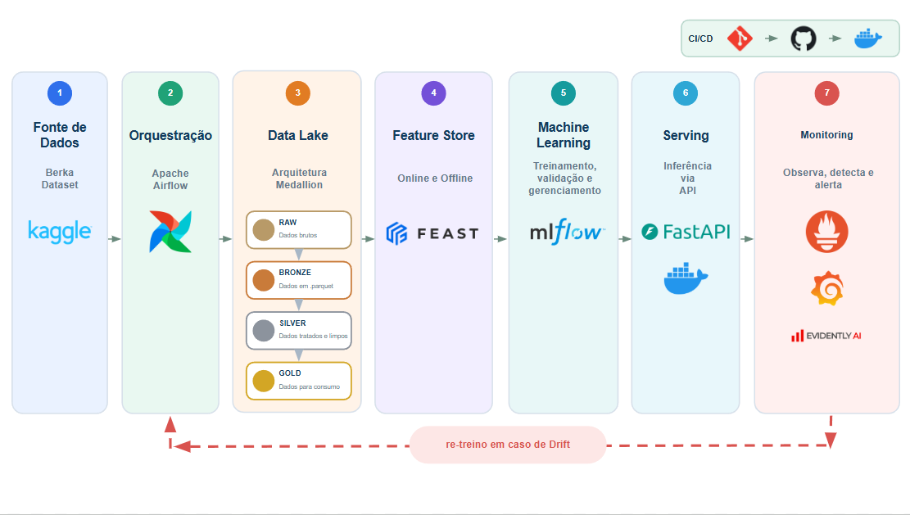
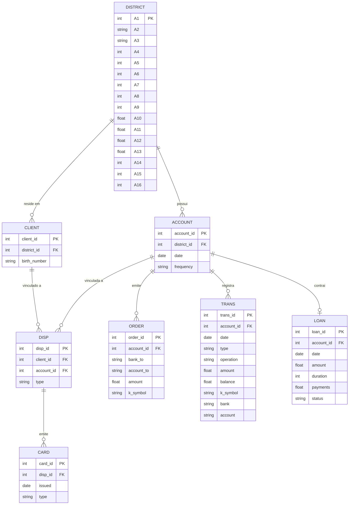
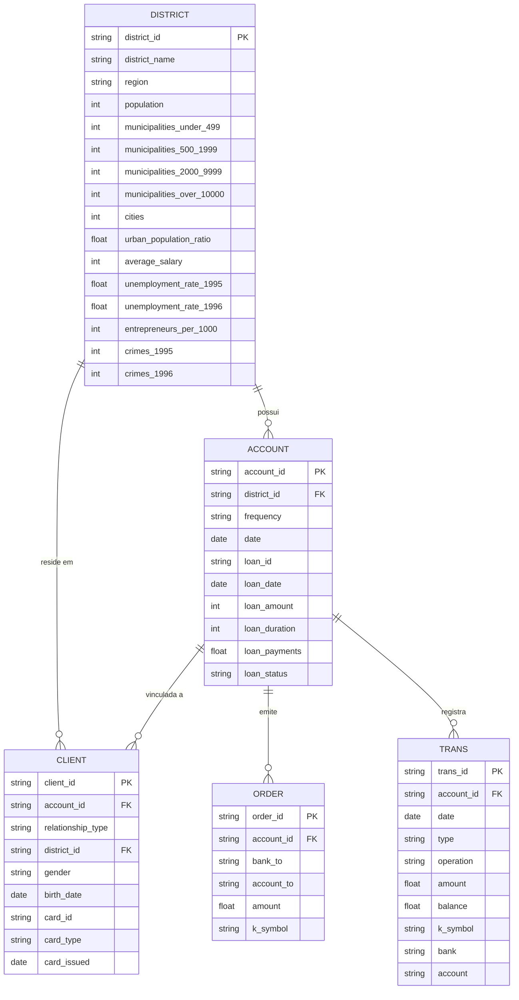

# The Bank Project

## Introdução

Este projeto tem como objetivo **prever quanto cada cliente vai gastar no próximo mês**. \
A partir do cojunto de dados [Berka](https://www.kaggle.com/datasets/marceloventura/the-berka-dataset), que reune aproximadamente 1 milhão de transações, realizadas por 4.500 contas pertencentes a 5.369 clientes de um banco tcheco durante o período de 1993 a 1998. \
Estimou-se o **total de saídas de uma conta no mês seguinte** em coroas tchecas (Kč), utilizando diferentes modelos de regressão (Regressão linear, Random Forest, Gradient Boosting e XGBoost). \
Durante a etapa de testes, com dados de agosto e novembro de 1998, o modelo que se destacou foi o Random Forest, com erro médio (MAE) de ~6,5 mil Kč por conta-mês, 20% menos que o baseline de "repetir a média dos 3 meses anteriores".

O projeto consiste em 3 etapas.
- Extração, processamento, enriquecimento e armazenamento dos dados utilizados;
- Geração de um modelo de ML (treino, registro, serving por API e monitoramento de drift);
- Geração de um chat conversacional (**ainda não iniciada**);

Tudo roda local, sem cloud!

## Pipeline

A imagem a seguir apresenta as principais etapas do pipeline elaborado.\


Cada etapa do pipeline é idempotente (reexecutar sobrescreve o resultado, sem duplicar nada) e pode ser executada individualmente, via Makefile:

| Comando          | Etapa                                                                                           |
| ---------------- | ----------------------------------------------------------------------------------------------- |
| `make ingest`    | [INGESTÃO] Kaggle → Raw (`.csv`) → Bronze (`.parquet`) |
| `make silver`    | [INGESTÃO] Bronze (`.parquet`) → Silver (`.parquet` limpo e tipado) |
| `make gold`      | [INGESTÃO] Silver → Gold (`gold_account` e `gold_account_monthly_movements`) |
| `make features`  | [ML] Criação e configuração da feature store |
| `make labels`    | [ML] Criação das labels para o modelo de regressão (`next_month_outflow`) a partir da Gold |
| `make train`     | [ML] Treinamento dos modelos e registro no MLflow |
| `make tune`      | [ML] Tuning de hiperparâmetros com Optuna e cross-validation temporal |
| `make promote`   | [ML] Promove o `challenger` caso supere os resultados do atual `champion` |
| `make serve`     | [API] Interface web para inferência em tempo real |
| `make drift`     | [MONITORAMENTO] Relatório de drift, via Evidently |
| `make retrain-check` | [MONITORAMENTO] Verifica a necessidade de re-treino por drift |
| `make up`/`down` | [CI/CD] Sobe ou derruba os containers: Airflow (:8080), o MLflow (:5000), a API (:8000), o Prometheus (:9090), o Pushgateway (:9091) e o Grafana (:3000) |
| `make monitoring-check` | [CI/CD] Valida `prometheus.yml` e `alerts.yml` com o `promtool` |
| `make cd-check`  | [CI/CD] Valida o GitHub Container Registry e realiza o smoke test das imagens locais |
| `make check`     | [CI/CD] Lint, type check e testes |

Nota: para baixar os arquivos brutos, as credenciais do Kaggle precisam estar no arquivo `.env`, conforme o modelo em `.env.example`.

### Executando o projeto

**0. Pré-requisitos:** 
Conta na Kaggle (KAGGLE_API_TOKEN);
Python 3.12;
Poetry 2.x;
Docker Docker Compose;
16 GB de RAM (GPU é opcional)

**1. Configurando o ambiente**

```bash
git clone https://github.com/TheElectron/the-bank-project.git && cd the-bank-project
make install
cp .env.example .env
```

**2. Subir a infraestrutura**

```bash
make up
```

| Serviço     | Endereço              | Observação                                             |
| ----------- | --------------------- | ------------------------------------------------------ |
| Airflow     | http://localhost:8080 | Sem tela de login (só local)                           |
| MLflow      | http://localhost:5000 | Experimento `regressao_outflow` e registry `outflow_regression` |
| API + UI    | http://localhost:8000 | Retorna 503 no `/health` até existir um `champion`    |
| Prometheus  | http://localhost:9090 |                                                        |
| Pushgateway | http://localhost:9091 |                                                        |
| Grafana     | http://localhost:3000 | Dashboards  (`admin`/`admin` para editar)              |

**3. Gerar os dados (Kaggle → Gold → Feast)**

```bash
make ingest silver gold labels features
```
Ou no Airflow, ative e dispare a DAG `data_pipeline`.

**4. Treinar o modelo e promover o campeão** 

```bash
make train
make promote
```
Ou no Airflow, dispare a DAG `training`. \
O treinamento dura aproximadamente 7 min com as configurações atuais `configs/best_params.yaml` atual. \
Opcional: 
```bash
make tune
```
Para realizar o tuning (~35 min de duração) e gera o arquivo `configs/best_params.yaml`.

**5. Interface Web**

Após realizar a promoção do modelo, abra http://localhost:8000. 

A API consulta o alias `champion` a cada 60 s, então **não precisa reiniciar** o container. \
Ao receber 200 no `/health` a interface carrega as seções Modelo e Desempenho. \
Documentação disponĩvel em http://localhost:8000/docs. \
Opcional:
```bash
make serve
```
Sobe a API localmente (precisa de `MLFLOW_TRACKING_URI` no `.env`).

**6. Monitoramento** 

```bash
make drift
```
Gera o relatório do Evidently em `data/monitoring/`, aproximadamente ~8 min.

```bash
make retrain-check
```
Valida o re-treino (sem disparar nada). \
O painel "Drift de dados" fica no dashboard do Grafana, e a interface da API lê o mesmo resumo na seção Modelo. \
Ou rode a DAG `monitoring` no Airflow (publica o resumo no Pushgateway e dispara a `training` se houver drift). 

**7. Encerrar e verificar**

```bash
make down
```
Derruba os containers, mas os volumes e data/ são mantidos.


## Dados

### Camada Bronze
O ponto de partida deste projeto é o [The Berka Dataset](https://www.kaggle.com/datasets/marceloventura/the-berka-dataset). \
Este conjunto de dados reúne em oito tabelas as informações financeiras de um banco tcheco, com transações de 1993 a 1998.\
A camada Bronze é uma cópia 1:1 do `.csv` original, sem tipagem nem tratamento de nulos, **todos os campos são gravados como string**.

#### `account`

4.500 registros.

| Campo         | Tipo   | Descrição                                                                                                                          |
| ------------- | ------ | ---------------------------------------------------------------------------------------------------------------------------------- |
| `account_id`  | string | Chave de identificação da conta. **PK**                                                                                            |
| `district_id` | string | Chave de identificação do distrito. **FK** → `district.A1`                                                                         |
| `date`        | string | Data de criação da conta, no formato `AAMMDD`.                                                                                     |
| `frequency`   | string | Frequência de emissão do extrato: `POPLATEK MESICNE` (mensal), `POPLATEK TYDNE` (semanal) ou `POPLATEK PO OBRATU` (por transação). |

#### `card`

892 registros.

| Campo     | Tipo   | Descrição                                                                                          |
| --------- | ------ | -------------------------------------------------------------------------------------------------- |
| `card_id` | string | Chave de identificação do cartão. **PK**                                                           |
| `disp_id` | string | Chave de identificação do `disp` (elemento que relaciona o cliente e suas contas). **FK** → `disp` |
| `issued`  | string | Data de emissão do cartão, no formato `AAMMDD` (com sufixo de hora `00:00:00`).                    |
| `type`    | string | Tipo de cartão: `junior`, `classic` ou `gold`.                                                     |

#### `client`

5.369 registros.

| Campo          | Tipo   | Descrição                                                                                       |
| -------------- | ------ | ----------------------------------------------------------------------------------------------- |
| `client_id`    | string | Chave de identificação do cliente. **PK**                                                       |
| `district_id`  | string | Chave de identificação do distrito de residência. **FK** → `district.A1`                        |
| `birth_number` | string | Data de nascimento e sexo: `AAMMDD` para homens e `AAMM+50DD` (mês somado de 50) para mulheres. |

#### `disp`

5.369 registros. Relaciona cada cliente à sua conta. Somente o proprietário pode emitir ordens ou realizar empréstimos.

| Campo        | Tipo   | Descrição                                                           |
| ------------ | ------ | ------------------------------------------------------------------- |
| `disp_id`    | string | Chave de identificação do `disp`. **PK**                            |
| `client_id`  | string | Identificador do cliente. **FK** → `client`                         |
| `account_id` | string | Identificador da conta. **FK** → `account`                          |
| `type`       | string | Tipo de `disp`: `OWNER` (proprietário) ou `DISPONENT` (dependente). |

#### `district`

77 registros.

| Campo | Tipo   | Descrição                                                |
| ----- | ------ | -------------------------------------------------------- |
| `A1`  | string | Identificador do distrito. **PK**                        |
| `A2`  | string | Nome do distrito.                                        |
| `A3`  | string | Região.                                                  |
| `A4`  | string | Número de habitantes.                                    |
| `A5`  | string | Número de municípios com menos de 499 habitantes.        |
| `A6`  | string | Número de municípios com 500 a 1999 habitantes.          |
| `A7`  | string | Número de municípios com 2000 a 9999 habitantes.         |
| `A8`  | string | Número de municípios com mais de 10000 habitantes.       |
| `A9`  | string | Número de cidades.                                       |
| `A10` | string | Proporção de habitantes urbanos.                         |
| `A11` | string | Salário médio.                                           |
| `A12` | string | Taxa de desemprego em 1995 (`?` no distrito 69).         |
| `A13` | string | Taxa de desemprego em 1996.                              |
| `A14` | string | Número de empreendedores por 1000 habitantes.            |
| `A15` | string | Número de crimes cometidos em 1995 (`?` no distrito 69). |
| `A16` | string | Número de crimes cometidos em 1996.                      |

#### `loan`

682 registros.

| Campo        | Tipo   | Descrição                                                                                                                                                                      |
| ------------ | ------ | ------------------------------------------------------------------------------------------------------------------------------------------------------------------------------ |
| `loan_id`    | string | Chave de identificação do empréstimo. **PK**                                                                                                                                   |
| `account_id` | string | Chave de identificação da conta. **FK** → `account`                                                                                                                            |
| `date`       | string | Data de concessão do empréstimo, no formato `AAMMDD`.                                                                                                                          |
| `amount`     | string | Valor do empréstimo.                                                                                                                                                           |
| `duration`   | string | Duração do empréstimo, em meses.                                                                                                                                               |
| `payments`   | string | Valor do pagamento mensal.                                                                                                                                                     |
| `status`     | string | Situação de pagamento do empréstimo: `A` (contrato encerrado, sem dívidas), `B` (encerrado, empréstimo não pago), `C` (em vigor, em dia) ou `D` (em vigor, cliente em débito). |

#### `order`

6.471 registros.

| Campo        | Tipo   | Descrição                                                                                                                           |
| ------------ | ------ | ----------------------------------------------------------------------------------------------------------------------------------- |
| `order_id`   | string | Chave de identificação da ordem. **PK**                                                                                             |
| `account_id` | string | Chave de identificação da conta emissora. **FK** → `account`                                                                        |
| `bank_to`    | string | Código do banco destinatário, composto por duas letras.                                                                             |
| `account_to` | string | Chave de identificação da conta destinatária.                                                                                       |
| `amount`     | string | Valor debitado da conta.                                                                                                            |
| `k_symbol`   | string | Propósito do pagamento: `POJISTNE` (seguro), `SIPO` (doméstico), `LEASING` (leasing), `UVER` (empréstimo) ou `" "` (não informado). |

#### `trans`

1.056.320 registros.

| Campo        | Tipo   | Descrição                                                                                                                                                                                                                                                                               |
| ------------ | ------ | --------------------------------------------------------------------------------------------------------------------------------------------------------------------------------------------------------------------------------------------------------------------------------------- |
| `trans_id`   | string | Chave de identificação da transação. **PK**                                                                                                                                                                                                                                             |
| `account_id` | string | Chave de identificação da conta. **FK** → `account`                                                                                                                                                                                                                                     |
| `date`       | string | Data da transação, no formato `AAMMDD`.                                                                                                                                                                                                                                                 |
| `type`       | string | Tipo de transação: `PRIJEM` (crédito), `VYDAJ` (débito) ou `VYBER` (saque; variação legada de `VYDAJ` para um subconjunto de transações).                                                                                                                                               |
| `operation`  | string | Modo de realização da transação: `VYBER KARTOU` (saque com cartão), `VKLAD` (depósito em dinheiro), `PREVOD Z UCTU` (transferência recebida, de outro banco), `VYBER` (saque em dinheiro) ou `PREVOD NA UCET` (transferência enviada, para outro banco). Vazio em parte das transações. |
| `amount`     | string | Valor da transação.                                                                                                                                                                                                                                                                     |
| `balance`    | string | Saldo da conta após a transação.                                                                                                                                                                                                                                                        |
| `k_symbol`   | string | Caracterização da transação: `POJISTNE` (seguro), `SLUZBY` (tarifa de emissão de extrato), `UROK` (juros), `SANKC. UROK` (juros de penalidade por saldo negativo), `SIPO` (pagamento doméstico), `DUCHOD` (pensão), `UVER` (pagamento de empréstimo) ou vazio.                          |
| `bank`       | string | Código do banco parceiro, composto por duas letras (aplicável apenas a transferências).                                                                                                                                                                                                 |
| `account`    | string | Chave de identificação da conta parceira (aplicável apenas a transferências).                                                                                                                                                                                                           |

#### Diagrama Entidade-Relacionamento 
O diagrama abaixo descreve a relação entre as 8 tabelas da camada bronze.

```mermaid
erDiagram
    DISTRICT ||--o{ ACCOUNT : "possui"
    DISTRICT ||--o{ CLIENT : "reside em"
    ACCOUNT ||--o{ DISP : "vinculada a"
    CLIENT ||--o{ DISP : "vinculado a"
    DISP ||--o{ CARD : "emite"
    ACCOUNT ||--o{ ORDER : "emite"
    ACCOUNT ||--o{ TRANS : "registra"
    ACCOUNT ||--o| LOAN : "contrai"

    DISTRICT {
        int A1 PK
        string A2
        string A3
        int A4
        int A5
        int A6
        int A7
        int A8
        int A9
        float A10
        float A11
        float A12
        float A13
        int A14
        int A15
        int A16
    }
    ACCOUNT {
        int account_id PK
        int district_id FK
        date date
        string frequency
    }
    CLIENT {
        int client_id PK
        int district_id FK
        string birth_number
    }
    DISP {
        int disp_id PK
        int client_id FK
        int account_id FK
        string type
    }
    CARD {
        int card_id PK
        int disp_id FK
        date issued
        string type
    }
    ORDER {
        int order_id PK
        int account_id FK
        string bank_to
        string account_to
        float amount
        string k_symbol
    }
    TRANS {
        int trans_id PK
        int account_id FK
        date date
        string type
        string operation
        float amount
        float balance
        string k_symbol
        string bank
        string account
    }
    LOAN {
        int loan_id PK
        int account_id FK
        date date
        float amount
        int duration
        float payments
        string status
    }
```

### Camada Silver
O principal objetivo da camada silver é realizar a limpeza e tipagem dos dados. \
Contudo, a camada também simplifica os relacionamentos entre as tabelas e reduzir os joins necessários nas etapas seguintes. \
Unindo os dados de `disp` e `card` na tabela `client` e os dados da tabela `loan` em `account`. \
Já `district` permanece como tabela dimensão separada (só as colunas A1..A16 foram renomeadas), pois um join simples já resolve a relação sem
introduzir ambiguidade.

Para realizar essas alterações foram aplicadas as seguintes validações:
- todo `client` tem exatamente 1 `disp`;
- todo `card` pertence a um `disp` do tipo `OWNER` (titular) único;
- toda `account` possui no máximo 1 `loan`.

Como resultado, temos:

#### `district`

77 registros. Tabela dimensão; colunas `A1`..`A16` renomeadas e tipadas (o `?` de `A12` e `A15` no distrito 69 vira nulo).

| Campo                       | Fonte Bronze   | Tipo   | Descrição                                                |
| --------------------------- | -------------- | ------ | -------------------------------------------------------- |
| `district_id`               | `district.A1`  | string | Identificador do distrito. **PK**                        |
| `district_name`             | `district.A2`  | string | Nome do distrito.                                        |
| `region`                    | `district.A3`  | string | Região.                                                  |
| `population`                | `district.A4`  | int    | Número de habitantes.                                    |
| `municipalities_under_499`  | `district.A5`  | int    | Número de municípios com menos de 499 habitantes.        |
| `municipalities_500_1999`   | `district.A6`  | int    | Número de municípios com 500 a 1999 habitantes.          |
| `municipalities_2000_9999`  | `district.A7`  | int    | Número de municípios com 2000 a 9999 habitantes.         |
| `municipalities_over_10000` | `district.A8`  | int    | Número de municípios com mais de 10000 habitantes.       |
| `cities`                    | `district.A9`  | int    | Número de cidades.                                       |
| `urban_population_ratio`    | `district.A10` | float  | Proporção de habitantes urbanos.                         |
| `average_salary`            | `district.A11` | int    | Salário médio.                                           |
| `unemployment_rate_1995`    | `district.A12` | float  | Taxa de desemprego em 1995. Nula no distrito 69.         |
| `unemployment_rate_1996`    | `district.A13` | float  | Taxa de desemprego em 1996.                              |
| `entrepreneurs_per_1000`    | `district.A14` | int    | Número de empreendedores por 1000 habitantes.            |
| `crimes_1995`               | `district.A15` | int    | Número de crimes cometidos em 1995. Nulo no distrito 69. |
| `crimes_1996`               | `district.A16` | int    | Número de crimes cometidos em 1996.                      |

#### `client`

5.369 registros. Consolida `client` + `disp` + `card`.

| Campo               | Fonte Bronze                      | Tipo   | Descrição                                                                                                                  |
| ------------------- | --------------------------------- | ------ | -------------------------------------------------------------------------------------------------------------------------- |
| `client_id`         | `client.client_id`                | string | Chave de identificação do cliente. **PK**                                                                                  |
| `account_id`        | `disp.account_id`                 | string | Conta do cliente (todo cliente pertence a exatamente 1 conta). **FK** → `account`                                          |
| `relationship_type` | `disp.type`                       | string | Papel do cliente na conta: `TITULAR` (proprietário; único que pode emitir ordens ou contrair empréstimos) ou `DEPENDENTE`. |
| `district_id`       | `client.district_id`              | string | Distrito de residência. **FK** → `district`                                                                                |
| `gender`            | Derivado de `client.birth_number` | string | Sexo do cliente (`M`/`F`).                                                                                                 |
| `birth_date`        | Derivado de `client.birth_number` | date   | Data de nascimento.                                                                                                        |
| `card_id`           | `card.card_id`                    | string | Chave de identificação do cartão. Nulo para os 4.477 clientes sem cartão (só titular pode ter).                            |
| `card_type`         | `card.type`                       | string | Tipo de cartão: `junior`, `classic` ou `gold`. Nulo sem cartão.                                                            |
| `card_issued`       | `card.issued`                     | date   | Data de emissão do cartão. Nula sem cartão.                                                                                |

#### `account`

4.500 registros. Consolida `account` + `loan`.

| Campo           | Fonte Bronze          | Tipo   | Descrição                                                                                                                                                                                              |
| --------------- | --------------------- | ------ | ------------------------------------------------------------------------------------------------------------------------------------------------------------------------------------------------------ |
| `account_id`    | `account.account_id`  | string | Chave de identificação da conta. **PK**                                                                                                                                                                |
| `district_id`   | `account.district_id` | string | Distrito da conta. **FK** → `district`                                                                                                                                                                 |
| `frequency`     | `account.frequency`   | string | Frequência de emissão do extrato: `MENSAL`, `SEMANAL` ou `POR_TRANSACAO`.                                                                                                                              |
| `date`          | `account.date`        | date   | Data de criação da conta.                                                                                                                                                                              |
| `loan_id`       | `loan.loan_id`        | string | Chave de identificação do empréstimo. Nulo para as 3.818 contas sem empréstimo.                                                                                                                        |
| `loan_date`     | `loan.date`           | date   | Data de concessão do empréstimo. Nula sem empréstimo.                                                                                                                                                  |
| `loan_amount`   | `loan.amount`         | float  | Valor do empréstimo. Nulo sem empréstimo.                                                                                                                                                              |
| `loan_duration` | `loan.duration`       | int    | Duração do empréstimo, em meses. Nula sem empréstimo.                                                                                                                                                  |
| `loan_payments` | `loan.payments`       | float  | Valor do pagamento mensal. Nulo sem empréstimo.                                                                                                                                                        |
| `loan_status`   | `loan.status`         | string | Situação de pagamento do empréstimo: `A` (contrato encerrado, sem dívidas), `B` (encerrado, empréstimo não pago), `C` (em vigor, em dia) ou `D` (em vigor, cliente em débito). Nulo se sem empréstimo. |

#### `order`

6.471 registros. Mesmo schema da origem, tipada e com `k_symbol` traduzido.

| Campo        | Fonte Bronze       | Tipo   | Descrição                                                                                                            |
| ------------ | ------------------ | ------ | -------------------------------------------------------------------------------------------------------------------- |
| `order_id`   | `order.order_id`   | string | Chave de identificação da ordem. **PK**                                                                              |
| `account_id` | `order.account_id` | string | Conta emissora. **FK** → `account`                                                                                   |
| `bank_to`    | `order.bank_to`    | string | Código do banco destinatário, composto por duas letras.                                                              |
| `account_to` | `order.account_to` | string | Chave de identificação da conta destinatária.                                                                        |
| `amount`     | `order.amount`     | float  | Valor debitado da conta.                                                                                             |
| `k_symbol`   | `order.k_symbol`   | string | Propósito do pagamento: `SEGURO`, `PAGAMENTO_DOMESTICO`, `LEASING` ou `PAGAMENTO_EMPRESTIMO`. Nulo se não informado. |

#### `trans`

1.056.320 registros. Mesmo schema da origem, tipada e com as categóricas traduzidas.

| Campo        | Fonte Bronze       | Tipo   | Descrição                                                                                                                                                     |
| ------------ | ------------------ | ------ | ------------------------------------------------------------------------------------------------------------------------------------------------------------- |
| `trans_id`   | `trans.trans_id`   | string | Chave de identificação da transação. **PK**                                                                                                                   |
| `account_id` | `trans.account_id` | string | Conta da transação. **FK** → `account`                                                                                                                        |
| `date`       | `trans.date`       | date   | Data da transação.                                                                                                                                            |
| `type`       | `trans.type`       | string | Tipo de transação: `CREDITO`, `DEBITO` ou `SAQUE` (variação legada de débito, mantida separada).                                                              |
| `operation`  | `trans.operation`  | string | Modo de realização: `SAQUE_CARTAO`, `DEPOSITO_DINHEIRO`, `TRANSFERENCIA_RECEBIDA`, `SAQUE_DINHEIRO` ou `TRANSFERENCIA_ENVIADA`. Nulo em parte das transações. |
| `amount`     | `trans.amount`     | float  | Valor da transação.                                                                                                                                           |
| `balance`    | `trans.balance`    | float  | Saldo da conta após a transação.                                                                                                                              |
| `k_symbol`   | `trans.k_symbol`   | string | Caracterização: `SEGURO`, `TARIFA_EXTRATO`, `JUROS`, `JUROS_PENALIDADE`, `PAGAMENTO_DOMESTICO`, `PENSAO` ou `PAGAMENTO_EMPRESTIMO`. Nulo se não informado.    |
| `bank`       | `trans.bank`       | string | Código do banco parceiro, composto por duas letras. Nulo fora de transferências.                                                                              |
| `account`    | `trans.account`    | string | Conta parceira. Nula fora de transferências.                                                                                                                  |

Tratamentos aplicados a todas as tabelas (`src/the_bank_project/silver/`):
- **Tipagem:** datas `AAMMDD` viram `datetime` (século XX), valores numéricos viram `Int64`/`Float64`, ids permanecem texto;
- **Nulos:** os placeholders `""`, `" "` e `"?"` viram nulo (ex.: `k_symbol` em branco, `A12`/`A15` do distrito 69);
- **Categóricas traduzidas:** `frequency` (`MENSAL`, `SEMANAL`, `POR_TRANSACAO`), `relationship_type`, `trans.type`
  (`CREDITO`, `DEBITO`, `SAQUE`), `operation` e `k_symbol` (ex.: `SEGURO`, `JUROS`, `PAGAMENTO_EMPRESTIMO`).
  Um código fora do mapa interrompe o job em vez de virar nulo. `loan_status` e `card_type` mantêm o código original;
- **Validação automática:** os merges 1:1 acima são verificados a cada execução (`validate="1:1"` do pandas e
  `check_silver`), junto com chaves primárias únicas, integridade referencial, 1 titular por conta e cartão só para
  titular. Se qualquer regra falhar, nada é gravado.

#### Diagrama Entidade-Relacionamento (conjunto reestruturado)
O diagrama abaixo descreve a relação entre as 8 tabelas da camada silver.

```mermaid
erDiagram
    DISTRICT ||--o{ ACCOUNT : "possui"
    DISTRICT ||--o{ CLIENT : "reside em"
    ACCOUNT ||--o{ CLIENT : "vinculada a"
    ACCOUNT ||--o{ ORDER : "emite"
    ACCOUNT ||--o{ TRANS : "registra"

    DISTRICT {
        string district_id PK
        string district_name
        string region
        int population
        int municipalities_under_499
        int municipalities_500_1999
        int municipalities_2000_9999
        int municipalities_over_10000
        int cities
        float urban_population_ratio
        int average_salary
        float unemployment_rate_1995
        float unemployment_rate_1996
        int entrepreneurs_per_1000
        int crimes_1995
        int crimes_1996
    }
    CLIENT {
        string client_id PK
        string account_id FK
        string relationship_type
        string district_id FK
        string gender
        date birth_date
        string card_id
        string card_type
        date card_issued
    }
    ACCOUNT {
        string account_id PK
        string district_id FK
        string frequency
        date date
        string loan_id
        date loan_date
        int loan_amount
        int loan_duration
        float loan_payments
        string loan_status
    }
    ORDER {
        string order_id PK
        string account_id FK
        string bank_to
        string account_to
        float amount
        string k_symbol
    }
    TRANS {
        string trans_id PK
        string account_id FK
        date date
        string type
        string operation
        float amount
        float balance
        string k_symbol
        string bank
        string account
    }
```
### Camada Gold

A camada Gold consolida os dados tratados na Silver em estruturas orientadas ao consumo analítico. \
A Gold não define os modelos de ML, nem seus conjuntos de treinamento e teste. \
Seu objetivo é disponibilizar dados confiáveis, reutilizáveis e temporalmente consistentes para que diferentes times possam construir suas próprias features, visões analíticas e modelos. 

Os dados são organizados em duas tabelas com granularidades diferentes, ambas com **`account_id` como entidade**:
- Visão cadastral da conta `gold_account`;
- Visão temporal do comportamento financeiro `gold_account_monthly_movements`;


**Por que uma visão por conta e não o cliente?** \
O Berka tem 5.369 clientes para 4.500 contas. \
869 dependentes compartilham a conta do titular e, portanto, possuem a mesma série de transações e o mesmo target. \
Usá-los como entidade duplicaria observações idênticas e enviesaria as métricas dos modelos. \
Dessa forma, os atributos do cliente que interessam ao modelo, como sexo e idade do titular, se possui cartão ou empréstimo entram como atributos da conta. 

#### `gold_account`

Esta tabela reúne as informações referentes a conta, ao titular, seu distrito e quando existentes, os dados de empréstimo e cartão.

| Campo                             | Fonte Silver                      | Tipo    | Descrição                                                                                             |
| --------------------------------- | --------------------------------- | ------- | ----------------------------------------------------------------------------------------------------- |
| `account_id`                      | `account.account_id`              | string  | Identificador único da conta. **PK**                                                                  |
| `account_open_date`               | `account.date`                    | date    | Data de criação da conta. **Timestamp do Feast.**                                                     |
| `account_frequency`               | `account.frequency`               | string  | Frequência de emissão do extrato: `MENSAL`, `SEMANAL` ou `POR_TRANSACAO`.                             |
| `district_id`                     | `account.district_id`             | string  | Distrito da conta.                                                                                    |
| `district_name`                   | `district.district_name`          | string  | Nome do distrito da conta.                                                                            |
| `district_region`                 | `district.region`                 | string  | Região do distrito.                                                                                   |
| `district_population`             | `district.population`             | int     | População do distrito.                                                                                |
| `district_urban_ratio`            | `district.urban_population_ratio` | float   | Proporção da população urbana do distrito.                                                            |
| `district_average_salary`         | `district.average_salary`         | int     | Salário médio do distrito.                                                                            |
| `district_unemployment_1995`      | `district.unemployment_rate_1995` | float   | Taxa de desemprego em 1995 (nula no distrito 69, sem dado na origem).                                 |
| `district_unemployment_1996`      | `district.unemployment_rate_1996` | float   | Taxa de desemprego em 1996.                                                                           |
| `district_entrepreneurs_per_1000` | `district.entrepreneurs_per_1000` | int     | Número de empreendedores por 1000 habitantes.                                                         |
| `district_crimes_1995`            | `district.crimes_1995`            | int     | Crimes registrados em 1995 (nulo no distrito 69).                                                     |
| `district_crimes_1996`            | `district.crimes_1996`            | int     | Crimes registrados em 1996.                                                                           |
| `owner_client_id`                 | `client.client_id`                | string  | Cliente titular da conta.                                                                             |
| `owner_gender`                    | `client.gender`                   | string  | Sexo do titular (`M`/`F`).                                                                            |
| `owner_birth_date`                | `client.birth_date`               | date    | Data de nascimento do titular.                                                                        |
| `owner_district_id`               | `client.district_id`              | string  | Distrito de residência do titular (difere do da conta em 409 contas).                                 |
| `dependent_count`                 | Derivado de `client`              | int     | Número de dependentes da conta (0 ou 1 no dataset).                                                   |
| `has_card`                        | Derivado de `client.card_id`      | boolean | Indica se a conta tem cartão (só o titular pode ter).                                                 |
| `card_type`                       | `client.card_type`                | string  | Tipo do cartão: `junior`, `classic` ou `gold`. Nulo sem cartão.                                       |
| `card_issued_date`                | `client.card_issued`              | date    | Data de emissão do cartão. Nulo sem cartão.                                                           |
| `has_loan`                        | Derivado de `account.loan_id`     | boolean | Indica se a conta tem empréstimo.                                                                     |
| `loan_date`                       | `account.loan_date`               | date    | Data de concessão do empréstimo.                                                                      |
| `loan_amount`                     | `account.loan_amount`             | float   | Valor concedido no empréstimo.                                                                        |
| `loan_duration`                   | `account.loan_duration`           | int     | Duração do empréstimo em meses.                                                                       |
| `loan_payments`                   | `account.loan_payments`           | float   | Valor da parcela mensal.                                                                              |
| `loan_payment_ratio`              | Derivado                          | float   | Relação entre a parcela mensal e o valor do empréstimo.                                               |
| `loan_status`                     | `account.loan_status`             | string  | Situação do empréstimo (`A`–`D`). Origem do label de inadimplência, **não é feature**.                |

> **Atenção aos campos `card_*` e `loan_*`:** são atributos estáticos, medidos ao fim do período, e a tabela é datada pela abertura da conta.
> Um cartão ou empréstimo emitido depois do mês de referência de uma observação **não** estava disponível naquele momento;
> Portanto, é fundamental atenção a campos como `card_issued_date`/`loan_date` para evitar vazamento de dados.

#### `gold_account_monthly_movements`

Esta tabela reúne indicadores como volume de movimentações, entradas, saídas, saldo, composição das operações e histórico.

- **`reference_month` é o último dia do mês** (ex.: `1995-03-31`), quando as features do mês ficam completas. \
É o `event_timestamp` no Feast: uma consulta point-in-time feita em `T` só enxerga meses já encerrados.
- **Meses sem movimento entram na série**, entre o primeiro e o último mês com transação de cada conta (269 meses, 0,15%), com fluxos e contagens 0 e saldo carregado do mês anterior. \
Sem isso, `LAG` e as médias móveis olhariam para meses distantes. \
Os valores mínimo/médio/máximo das transações ficam nulos nesses meses.
- **Entradas** são as transações do tipo `CREDITO`.
- **Saídas** são `DEBITO` e `SAQUE` (o `VYBER` do tipo, variante legada de débito).
- **`opening_balance` é uma estimativa.** O `balance` do Berka não fecha como razão contábil (`closing_balance ≠ opening_balance + net_flow` em cerca de 25% dos meses) e o `trans_id` não segue a ordem real dentro do mesmo dia. \
Por isso, o saldo de abertura/fechamento do dia é resolvido pela cadeia `balance − valor` das próprias transações do dia, e não pelo `trans_id`.
- Janelas (`*_3m_*`, `*_6m_*`) usam **só o mês de referência e os anteriores**; onde há menos meses que a janela, usam os disponíveis. Variações percentuais são nulas quando o mês anterior é 0.
- `leasing_payment_amount`, previsto no desenho original, foi removido: `LEASING` só aparece em `order`, nunca em `trans`.

| Campo                          | Fonte                                   | Descrição                                                    |
| ------------------------------ | --------------------------------------- | ------------------------------------------------------------ |
| `account_id`                   | `trans.account_id`                      | Identificador da conta. **PK composta**                      |
| `reference_month`              | Derivado de `trans.date`                | Último dia do mês de referência. **PK composta, timestamp do Feast** |
| `account_age_months`           | Derivado                                | Idade da conta, em meses, no mês de referência.              |
| `year`                         | Derivado                                | Ano do mês de referência.                                    |
| `month`                        | Derivado                                | Mês do mês de referência.                                    |
| `transaction_count`            | `COUNT(trans_id)`                       | Número total de transações no mês.                           |
| `active_days`                  | `COUNT(DISTINCT date)`                  | Número de dias com movimentação.                             |
| `credit_transaction_count`     | `type = CREDITO`                        | Quantidade de transações de crédito.                         |
| `debit_transaction_count`      | `type IN (DEBITO, SAQUE)`               | Quantidade de transações de saída.                           |
| `withdrawal_transaction_count` | `operation IN (SAQUE_DINHEIRO, SAQUE_CARTAO)` | Quantidade de saques.                                  |
| `transfer_transaction_count`   | `operation IN (TRANSFERENCIA_*)`        | Quantidade de transferências (enviadas e recebidas).         |
| `inflow_amount`                | `type = CREDITO`                        | Total de recursos recebidos no mês.                          |
| `outflow_amount`               | `type IN (DEBITO, SAQUE)`               | Total de recursos debitados no mês.                          |
| `net_flow`                     | Derivado                                | Entradas menos saídas.                                       |
| `avg_transaction_amount`       | `amount`                                | Valor médio das transações.                                  |
| `min_transaction_amount`       | `amount`                                | Menor valor de transação.                                    |
| `max_transaction_amount`       | `amount`                                | Maior valor de transação.                                    |
| `opening_balance`              | Derivado de `balance`                   | Saldo estimado antes da primeira transação do mês.           |
| `closing_balance`              | Derivado de `balance`                   | Saldo após a última transação do mês.                        |
| `avg_balance`                  | `AVG(balance)`                          | Saldo médio observado nas transações do mês.                 |
| `min_balance`                  | `MIN(balance)`                          | Menor saldo observado no mês.                                |
| `max_balance`                  | `MAX(balance)`                          | Maior saldo observado no mês.                                |
| `cash_withdrawal_amount`       | `operation = SAQUE_DINHEIRO`            | Valor total de saques em dinheiro.                           |
| `card_withdrawal_amount`       | `operation = SAQUE_CARTAO`              | Valor total de saques com cartão.                            |
| `transfer_out_amount`          | `operation = TRANSFERENCIA_ENVIADA`     | Valor total de transferências enviadas.                      |
| `transfer_in_amount`           | `operation = TRANSFERENCIA_RECEBIDA`    | Valor total de transferências recebidas.                     |
| `loan_payment_amount`          | `k_symbol = PAGAMENTO_EMPRESTIMO`       | Valor total de pagamentos de empréstimos.                    |
| `insurance_payment_amount`     | `k_symbol = SEGURO`                     | Valor total de pagamentos de seguros.                        |
| `domestic_payment_amount`      | `k_symbol = PAGAMENTO_DOMESTICO`        | Valor total de pagamentos domésticos.                        |
| `interest_amount`              | `k_symbol = JUROS`                      | Valor associado a juros.                                     |
| `penalty_interest_amount`      | `k_symbol = JUROS_PENALIDADE`           | Valor associado a juros de penalidade.                       |
| `loan_payment_count`           | `k_symbol = PAGAMENTO_EMPRESTIMO`       | Quantidade de pagamentos de empréstimos.                     |
| `transfer_out_count`           | `operation`                             | Quantidade de transferências enviadas.                       |
| `transfer_in_count`            | `operation`                             | Quantidade de transferências recebidas.                      |
| `cash_withdrawal_count`        | `operation`                             | Quantidade de saques em dinheiro.                            |
| `card_withdrawal_count`        | `operation`                             | Quantidade de saques com cartão.                             |
| `previous_month_outflow`       | `LAG(outflow_amount)`                   | Total de saídas do mês anterior.                             |
| `previous_month_inflow`        | `LAG(inflow_amount)`                    | Total de entradas do mês anterior.                           |
| `outflow_3m_avg`               | Média móvel                             | Média das saídas dos últimos 3 meses (incluindo o atual).    |
| `outflow_3m_sum`               | Soma móvel                              | Soma das saídas dos últimos 3 meses.                         |
| `outflow_6m_avg`               | Média móvel                             | Média das saídas dos últimos 6 meses.                        |
| `inflow_3m_avg`                | Média móvel                             | Média das entradas dos últimos 3 meses.                      |
| `avg_balance_3m`               | Média móvel                             | Média do saldo médio dos últimos 3 meses.                    |
| `transaction_count_3m_avg`     | Média móvel                             | Média da quantidade de transações dos últimos 3 meses.       |
| `outflow_mom_change`           | Derivado                                | Variação percentual das saídas em relação ao mês anterior.   |
| `inflow_mom_change`            | Derivado                                | Variação percentual das entradas em relação ao mês anterior. |
| `balance_mom_change`           | Derivado                                | Variação absoluta do saldo de fechamento em relação ao mês anterior. |

#### Validações automáticas

`check_gold` roda a cada execução e, se qualquer regra falhar, nada é gravado:
- PK única em cada tabela e `gold_account` com exatamente as contas da Silver;
- sem nulos nos campos obrigatórios (chaves, datas, fluxos, saldos e janelas);
- toda conta da tabela mensal existe em `gold_account`;
- meses contíguos por conta e `reference_month` sempre no fim do mês;
- consistência das janelas: `outflow_3m_sum` não é menor que a saída do mês e `previous_month_outflow` bate com o mês anterior.


#### Diagrama Entidade-Relacionamento
O diagrama abaixo descreve a relação entre as 8 tabelas da camada gold.


```mermaid
erDiagram
    GOLD_ACCOUNT ||--o{ GOLD_ACCOUNT_MONTHLY_MOVEMENTS : "possui histórico mensal"

    GOLD_ACCOUNT {
        string account_id PK
        date account_open_date
        string account_frequency
        string district_id
        string district_name
        string district_region
        int district_population
        float district_urban_ratio
        int district_average_salary
        float district_unemployment_1995
        float district_unemployment_1996
        int district_entrepreneurs_per_1000
        int district_crimes_1995
        int district_crimes_1996
        string owner_client_id
        string owner_gender
        date owner_birth_date
        string owner_district_id
        int dependent_count
        boolean has_card
        string card_type
        date card_issued_date
        boolean has_loan
        date loan_date
        float loan_amount
        int loan_duration
        float loan_payments
        float loan_payment_ratio
        string loan_status
    }

    GOLD_ACCOUNT_MONTHLY_MOVEMENTS {
        string account_id PK
        date reference_month PK
        int account_age_months
        int year
        int month
        int transaction_count
        int active_days
        int credit_transaction_count
        int debit_transaction_count
        int withdrawal_transaction_count
        int transfer_transaction_count
        float inflow_amount
        float outflow_amount
        float net_flow
        float avg_transaction_amount
        float min_transaction_amount
        float max_transaction_amount
        float opening_balance
        float closing_balance
        float avg_balance
        float min_balance
        float max_balance
        float cash_withdrawal_amount
        float card_withdrawal_amount
        float transfer_out_amount
        float transfer_in_amount
        float loan_payment_amount
        float insurance_payment_amount
        float domestic_payment_amount
        float interest_amount
        float penalty_interest_amount
        int loan_payment_count
        int transfer_out_count
        int transfer_in_count
        int cash_withdrawal_count
        int card_withdrawal_count
        float previous_month_outflow
        float previous_month_inflow
        float outflow_3m_avg
        float outflow_3m_sum
        float outflow_6m_avg
        float inflow_3m_avg
        float avg_balance_3m
        float transaction_count_3m_avg
        float outflow_mom_change
        float inflow_mom_change
        float balance_mom_change
    }
```

## Feature Store

A feature store atua como **único ponto de acesso às features**. \
As tabelas Gold fornecem os dados, enquanto os **targets** são definidos de acordo com cada problema de negócio. \
Essa separação permite reutilizar a mesma Gold no treinamento de diferentes modelos, além de padronizar as informações utilizadas e evitar o vazamento de dados. \
As etapas de treino e serving passam por `the_bank_project.features`, e nenhum outro módulo lê a Gold diretamente.

- **Entidade:** `account`(`account_id`);
- **Offline store:** Dados de treinamento;
- **Online store:** Dados recentes para inferência, via API;
- **Views:** `account_static` (`gold_account`) e `account_monthly` (`gold_account_monthly_movements`);
- **FeatureService `outflow_regression`:** Visão mensal e histórica utilizadas pelo modelo.


## Modelos Supervisionados
### Modelo de regressão | Prevendo os gastos de uma conta no próximo mês

O objetivo deste modelo é prever o valor total de saídas de uma conta no mês seguinte.
Matematicamente:

```text
X(T) → y(T+1)
```

Onde:

```text
X(T) = comportamento observado até o mês T
y(T+1) = outflow da conta no mês T+1
```

**Variável alvo:**

```text
next_month_outflow = outflow_amount(T+1)

Nota: A variável target `next_month_outflow` não faz parte da Gold nem da Feature Store.
Ela é extraída a partir da tabela de labels, que desloca `outflow_amount` para o mês seguinte dentro de cada conta;
```

**Granularidade:**

```text
1 observação = 1 conta por mês
```

A Gold tem 185.326 registros mensais (1.056.320 transações agregadas por conta). \
O último mês de cada conta não tem mês seguinte e não gera observação de treino, o que deixa **180.826 observações** (meses 1993-01 a 1998-11), gravadas em `data/gold/labels_outflow.parquet`.

**Modelos:**
Foram testados diferentes modelos de regressão (Regressão linear, Random Forest, Gradient Boosting e XGBoost). \
Além deles, duas regras ingênuas servem de baseline: a média de saídas dos 3 meses anteriores e a persistência (repetir o mês atual). \

> Nota: Com exceção da regressão linear, os modelos treinam em `log1p(target)` e revertem com `expm1` na previsão.

**Métricas observadas:**

```text
MAE     (Erro médio absoluto)
RMSE    (Raiz do erro quadrático médio)
R²      (R Quadrado)
```

#### Features Utilizadas

**Visão mensal:**

```text
active_days
inflow_amount
outflow_amount
net_flow
transaction_count
avg_transaction_amount
max_transaction_amount
opening_balance
closing_balance
avg_balance
min_balance
max_balance
cash_withdrawal_amount
card_withdrawal_amount
transfer_out_amount
loan_payment_amount
insurance_payment_amount
domestic_payment_amount
```

**Histórico:**

```text
previous_month_outflow
previous_month_inflow
outflow_3m_avg
outflow_3m_sum
outflow_6m_avg
inflow_3m_avg
avg_balance_3m
transaction_count_3m_avg
outflow_mom_change
inflow_mom_change
balance_mom_change
```

#### Divisão e seleção

Devido ao caráter temporal, optou-se por uma divisão cronológica dos dados, escolhendo os cortes para chegar perto de 70/20/10 das *linhas* (as linhas se concentram nos anos finais, então 70% das linhas não são 70% do tempo). \
Entre os conjuntos há **1 mês de folga** descartado: o label de T é o outflow de T+1, então sem folga o último mês de treino usaria como label um valor que já é feature do primeiro mês de validação.

```text
Treino     1993-01 .. 1997-10   122.618 linhas
(folga     1997-11)
Validação  1997-12 .. 1998-06    31.420 linhas
(folga     1998-07)
Teste      1998-08 .. 1998-11    17.874 linhas
```

Cada modelo testa 8 configurações de hiperparâmetros diferentes, ajustadas **durante o treino** e avaliadas **na validação**. \
Caso o arquivo `configs/best_params.yaml` seja gerado na etapa de tuning, só a configuração otimizada é avaliada. \
O vencedor de cada algoritmo é reajustado em treino + validação e medido **uma vez** no teste. \
O modelo vencedor é aquele que possuir o menor valor MAE para o conjunto de **validação**.

#### Resultados (execução de 2026-09-24)

| Modelo               | MAE validação | MAE teste | RMSE teste | R² teste |
| -------------------- | ------------- | --------- | ---------- | -------- |
| Média dos 3 meses    | 9.918         | 8.183     | 15.871     | 0,35     |
| Persistência         | 11.577        | 9.197     | 18.910     | 0,08     |
| Regressão linear     | 8.051         | 7.970     | 13.391     | 0,54     |
| Gradient Boosting    | 7.232         | 6.637     | 12.979     | 0,57     |
| XGBoost              | 7.112         | 6.557     | 12.896     | 0,57     |
| **Random Forest**    | **7.059**     | **6.478** | 12.990     | 0,57     |

Observe que os três modelos baseados em árvores erram ~20% menos que o melhor dummy, já a regressão linear só empata com ele no teste. \
**A diferença entre Random Forest, XGBoost e Gradient Boosting é pequena (menos de 2,5% no MAE)** no conjunto de testes, o desempate e a escolha do Random Forest vem do conjunto de validação, com uma vantagem de ~0,8% sobre o XGBoost, que não pode ser entendida como definitiva. \
O R² de 0,57 mostra que boa parte da variação mensal das saídas não está coberta pelas features atuais. 

#### Treinamento: iterações e tempo

Cada modelo foi ajustado duas vezes no `make train`, e os resultados na etapa de teste são enviados ao registry. 
A tabela a seguir apresenta o tempo de treinamento e o numéro de árvores/iterações para cada modelo.

| Modelo            | Árvores/iterações                     | Tempo total               | Com tuning                                                  |
| ----------------- | ------------------------------------- | ------------------------- | ------------------------------------------------------------|
| Regressão linear  | não se aplica                         | 1,1 s                     | não se aplica                                               |
| Random Forest     | 150 → 191 árvores                     | 195 s                     | 22 min (13 tentativas, limite de tempo)                     |
| Gradient Boosting | 300 → 232 iterações                   | 4,9 s                     | 3,3 min (30 tentativas, limite de tentativas)               |
| XGBoost           | 400 → 335 árvores                     | 18,2 s                    | 10 min (30 tentativas limite de tentativas)                 |


> Nota: Tempo total de cada run no MLflow.

#### Features mais importantes

Valores obtidos a partir do campeão  Random Forest.

| # | Feature                                        | Grupo                 | Importância |
| - | ---------------------------------------------- | --------------------- | ----------- |
| 1 | Saídas do mês (`outflow_amount`)               | Movimentação do mês   | 14,6%       |
| 2 | Saques em dinheiro (`cash_withdrawal_amount`)  | Composição dos gastos | 13,6%       |
| 3 | Saídas: média de 3 meses (`outflow_3m_avg`)    | Histórico e tendência | 12,8%       |
| 4 | Saídas: soma de 3 meses (`outflow_3m_sum`)     | Histórico e tendência | 6,6%        |
| 5 | Entradas: média de 3 meses (`inflow_3m_avg`)   | Histórico e tendência | 6,4%        |
| 6 | Maior transação (`max_transaction_amount`)     | Movimentação do mês   | 5,2%        |
| 7 | Saídas: média de 6 meses (`outflow_6m_avg`)    | Histórico e tendência | 4,8%        |
| 8 | Nº de transações (`transaction_count`)         | Movimentação do mês   | 4,5%        |
| 9 | Maior saldo (`max_balance`)                    | Saldo                 | 3,6%        |
| 10| Entradas do mês (`inflow_amount`)              | Movimentação do mês   | 3,3%        |

Por grupo, temos: 
- **Histórico e tendência 40,4%**
- **Movimentação do mês 32,9%** 
- **Composição dos gastos 14,6%**
- **Saldo 12,1%**
 
Podemos afirmar que `outflow_amount`, `cash_withdrawal_amount` e `outflow_3m_avg` são as melhores informações para prever os gastos futuros! \
As três primeiras features sozinhas somam 41% de importância, e os saques em dinheiro são o único componente de gasto com peso relevante.


#### Exemplo com dados reais

Duas contas reais, validadas pelo `POST /predict`, com `reference_month` = `1998-10-31`.
O modelo recebe as 29 features de outubro e prevê as saídas de novembro de 1998:

```bash
curl -X POST localhost:8000/predict -H 'content-type: application/json' \
  -d '{"account_ids": ["1", "2"], "reference_month": "1998-10-31", "include_features": true}'
```

| Conta | Saídas em out/1998 | Média de 3 meses (baseline) | **Previsto (nov/1998)** | Real (nov/1998) | Erro do modelo | Erro do baseline |
| ----- | ------------------ | --------------------------- | ----------------------- | --------------- | -------------- | ---------------- |
| 1     | 2.467 Kč           | 4.723 Kč                    | **3.413 Kč**            | 2.977 Kč        | +436 Kč (15%)  | +1.747 Kč (59%)  |
| 2     | 18.381 Kč          | 21.847 Kč                   | **22.023 Kč**           | 29.891 Kč       | −7.867 Kč (26%)| −8.044 Kč (27%)  |

Na conta 1 com saídas de ~2,5 mil Kč, o modelo erra apenas 15%, já a média de 3 meses, superestima os valores de novembro em quase 60%. \
Enquanto a conta 2, com saídas de ~18 mil Kč, o modelo não antecipa um pico em novembro e empata com o baseline. \


## Interface Web para inferência

A interface web permite que o usuário possa testar o modelo em tempo real, gerando o **total de gastos de uma conta no próximo mês**, utilizando o modelo registrado `champion` do MLflow e as features do Feast. 

### Endpoints

| Endpoint                                | Função                                                                                   |
| --------------------------------------- | ---------------------------------------------------------------------------------------- |
| `POST /predict`                         | Previsão em lote (até 100 contas). Contrato público, previsto para o chat da Etapa 3 (não iniciada). |
| `GET /health`                           | Campeão carregado e tamanho do catálogo. Responde 503 se não houver `champion`.          |
| `GET /metrics`                          | Métricas no formato Prometheus.                                                          |
| `GET /api/model`                        | Campeão, métricas no teste, comparativo com os baselines, features (nome, grupo, peso), hiperparâmetros, origem deles e data do treino. |
| `GET /api/monitoring`                   | Último relatório de drift e último re-treino disparado por ele (`available: false` se ainda não rodou). Não depende do campeão. |
| `GET /api/months`, `/api/accounts`      | Meses disponíveis (com o conjunto do treino) e busca/sorteio de contas.                  |
| `GET /api/accounts/{id}/history`        | Entradas, saídas e saldo até o mês T e o valor real de T+1.                              |
| `GET /api/evaluation`                   | Desempenho no teste inteiro (calculado em segundo plano após carregar o modelo).         |
| `GET /docs`                             | Documentação OpenAPI interativa.                                                         |

```bash
curl -X POST localhost:8000/predict -H 'content-type: application/json' \
  -d '{"account_ids": ["1", "2"], "reference_month": "1998-11-30"}'
```

```json
{
  "model": {"name": "outflow_regression", "version": "1", "algorithm": "random_forest"},
  "predictions": [
    {"account_id": "1", "features_as_of": "1998-11-30", "target_month": "1998-12-31",
     "predicted_next_month_outflow": 3812.4, "actual_next_month_outflow": 6952.0,
     "baseline_next_month_outflow": 4803.0, "error": -3139.6, "split": "teste", "features": null}
  ],
  "not_found": []
}
```

- Sem `reference_month`, a API usa o mês **mais recente** do online store (`features_as_of`) e não devolve valor real. Com ele, as features vêm do offline store no ponto do tempo pedido e o valor real de T+1 vem junto, quando conhecido. \
  Nos dois caminhos as features e a previsão são idênticas para o mesmo mês (há teste de paridade treino/serving).
- Contas sem features vão em `not_found`, sem derrubar o lote. `include_features: true` devolve as features usadas.
- **Troca de campeão sem reiniciar:** a API consulta o alias `champion` a cada 60 s e recarrega o modelo se a versão mudou. Um campeão cujas features divergem das do Feast não substitui o que está rodando.
- **Métricas Prometheus** (`/metrics`): requisições e latência por rota, previsões geradas, contas sem features, distribuição dos valores previstos e a versão do modelo carregado.

### Limitações

- **Sem autenticação:** é um projeto local.
- **O painel de monitoramento lê arquivos, não o Prometheus:** a API monta `data/monitoring/` somente leitura (o resumo que a DAG `monitoring` grava). Sem esse arquivo, o painel mostra que ainda não há relatório.
- **O comparativo de modelos é o do treino do campeão:** só entram runs até 3 h de distância do run do campeão, para que um treino posterior (ex.: um challenger rejeitado pelo gate) não apareça com os números dele.
- **Features "mais recentes" são de 1998:** o dataset é histórico e as views do Feast não têm TTL. Uma conta parada há meses seria prevista com dados velhos, e por isso a resposta traz `features_as_of`.
- **Mesmas versões em todo lugar:** a imagem da API e o venv do Airflow são instalados pelo `poetry.lock`, porque o modelo do MLflow é um pickle que só carrega com as versões com que foi treinado.

## Monitoramento

O **Prometheus** (http://localhost:9090) coleta as métricas da API a cada 15 s. \
Enquanto o **Grafana** (http://localhost:3000) apresenta os resultados no dashboard "Monitoramento: API e drift".

| Bloco do dashboard | O que mostra                                                                                          |
| ------------------ | ----------------------------------------------------------------------------------------------------- |
| Visão geral        | API no ar, versão/algoritmo do campeão, idade do campeão carregado e requisições/s.                   |
| Tráfego e latência | Requisições/s por rota, latência p50/p95 por rota e taxa de erros 5xx.                                |
| Previsões          | Previsões e chamadas por modo, fração de contas sem features e distribuição dos valores previstos.    |
| Drift de dados     | Veredito do dataset, fração e contagem de features com drift, idade do relatório e top 10 scores.     |

Alertas (`monitoring/alerts.yml`, visíveis em http://localhost:9090/alerts): 
- API fora do ar; 
- Nenhum campeão disponível; 
- Taxa de erros 5xx acima de 5%;
- p95 do `/predict` acima de 1 s;
- Drift detectado na última execução e relatório de drift. 

> Nota: A infra é local, portando não há Alertmanager.


### Drift de dados

Utilizando o **Evidently**, valida o drift de dados e grava em `data/monitoring/` um relatório HTML (`drift_report.html`) e um resumo (`drift_summary.json`). 

| Parâmetro (`monitoring` em `global_config.yaml`) | Valor | Significado                                                                                  |
| ------------------------------------------------ | ----- | -------------------------------------------------------------------------------------------- |
| `current_months`                                 | 3     | Janela "atual": os 3 últimos meses da Gold (ago–nov/1998 já é teste; ver "Modelo de regressão"). |
| `feature_threshold`                              | 0,1   | Uma feature deriva se a distância de Wasserstein, em desvios da referência, passa de 0,1.    |
| `drift_share_threshold`                          | 0,5   | Há drift no dataset se 50% das features (ou mais) derivam.                                   |

- **Replay temporal:** o dataset é histórico e a API não persiste requisições, então o "dado atual" é simulado: a referência são os meses de treino e validação (o que o modelo viu) e a janela atual, os últimos meses. Se a janela invadir a referência, o comando falha em vez de comparar dados iguais.
- **Drift não é erro:** o comando só falha se a etapa quebrar. Quem decide o que fazer com o resultado é a DAG (ver "Re-treino por drift" abaixo).
- **DAG `monitoring` (Airflow, semanal + disparo manual):** `drift_report` roda `run_drift` e `publish_metrics` envia o resumo ao **Pushgateway** (`PUSHGATEWAY_URL`, definida no compose), de onde o Prometheus o coleta (job `drift`, `honor_labels`). O Pushgateway persiste em volume, então o último resumo sobrevive a um restart. Pressupõe o `data_pipeline` já executado (labels e Feast). `python -m the_bank_project.monitoring push` publica o último resumo sem recalcular.
- **Resultado nos dados reais (1993-01..1998-06 x 1998-09..1998-11):** 12 de 29 features (41%) derivaram, logo abaixo do limiar, então **não há drift no dataset**. As que derivam são quase todas de nível (saldos, contagens de transações, valores de transferências), esperado num banco cujos saldos crescem ao longo dos anos; as de variação e as de entradas ficam estáveis. Com a margem tão curta, uma janela ou um limiar diferentes mudariam o veredito.
- **Amostras pequenas geram drift falso:** com poucas linhas, o ruído amostral sozinho passa de 0,1. Nos dados reais a janela tem ~13 mil linhas, sem esse problema.

Métricas publicadas: `drift_detected`, `drift_share`, `drift_features_drifted`, `drift_report_timestamp_seconds` e `drift_feature_score{feature=...}`. `retrain_last_timestamp_seconds` (quando o drift disparou o último re-treino; só existe depois do primeiro disparo).

### Re-treino por drift

Na DAG `monitoring`, depois do `drift_report`, a task `decide_retrain` aplica `should_retrain` (função pura em `the_bank_project.monitoring.retrain`) ao último resumo. Se retornar `retrain`, a task `trigger_training` (`TriggerDagRunOperator`) dispara a DAG `training`, cujo `promote` é o mesmo gate da Fase 5: o campeão só muda se o challenger tiver MAE menor no mesmo teste.

| Decisão     | Quando                                                                              |
| ----------- | ----------------------------------------------------------------------------------- |
| `retrain`   | Há drift no dataset e o último disparo foi há `retrain_cooldown_days` (14) ou mais. |
| `no_drift`  | O drift do dataset está abaixo do limiar.                                           |
| `cooldown`  | Há drift, mas o último disparo foi há menos de 14 dias.                             |
| `disabled`  | `monitoring.retrain_enabled: false`.                                                |

- **Cooldown em disco:** o disparo é registrado em `data/monitoring/last_retrain.json` (não no banco do Airflow, inacessível à task do venv) e o cooldown é gravado na decisão, não após o disparo. Se o disparo falhar, o próximo só ocorre depois do cooldown, ou apagando esse arquivo. `make retrain-check` mostra a decisão sem gravar nada.
- **A DAG `training` precisa estar ativa (unpaused):** senão o run disparado fica na fila.
- **Limite do replay temporal:** o dataset é estático e o split é cronológico fixo, então re-treinar reproduz, em essência, o mesmo modelo e o gate tende a mantê-lo. A 7c valida o mecanismo (gatilho, cooldown e gate), não um ganho de desempenho; com dados novos de verdade o mesmo fluxo passaria a fazer sentido. O drift também não some após o re-treino, então sem o cooldown o gatilho dispararia toda semana.
- **Validação ponta a ponta (2026-09-25, `drift_share_threshold` = 0,3 para forçar o drift, 41% >= 30%):** o 1º run da DAG `monitoring` decidiu `retrain`, gravou o cooldown, publicou `retrain_last_timestamp_seconds` e disparou a `training`, que treinou o challenger v3 e o gate o **rejeitou** (`6477.51 vs campeão 6477.51`: o mesmo modelo, como previsto), mantendo o campeão v1. O 2º run, minutos depois, decidiu `cooldown`: `trigger_training` ficou `skipped` e nenhum novo run de `training` foi criado. Depois a config e o estado (`last_retrain.json`) foram restaurados. A v3 segue no Registry com o alias `challenger`. Decisão e cooldown também têm testes unitários (`tests/monitoring/test_retrain.py`).

## Entrega (CI/CD)

- **CI** (`.github/workflows/ci.yml`): lint, mypy, testes com cobertura e `dag-check` a cada push em `master` e em PRs.
- **CD** (`.github/workflows/cd.yml`): quando o CI passa em `master` (`workflow_run`, ou disparo manual), constrói as imagens `airflow`, `mlflow` e `serving`, faz um smoke test de cada uma (`scripts/smoke_image.sh`) e só então as publica no **GHCR** (`ghcr.io/<dono>/the-bank-project-<imagem>`, tags `sha-<curto>` e `latest`). Sem cloud, "deploy" é isso mais o compose local.
- **Rodar com as imagens publicadas:** `docker compose -f docker-compose.yml -f docker-compose.ghcr.yml up -d` (`GHCR_OWNER` e `IMAGE_TAG` ajustam dono e tag). `make up` continua construindo localmente. Os pacotes nascem privados no GitHub; é preciso `docker login ghcr.io` ou torná-los públicos.
- **Verificação local:** `make cd-check` valida o override e roda o smoke nas imagens locais; `tests/cd/` garante que a matrix, os `Dockerfile`, o compose e o override falam dos mesmos nomes.
- **Limites:** o smoke test não sobe a stack (a API precisa da Gold e do Feast, ausentes num runner de CI). O 1º run do `cd.yml` (2026-09-26) publicou as três imagens no GHCR; subir a stack a partir delas com o override (`pull` + `up -d`) também foi validado: API, MLflow e Airflow saudáveis e uma previsão real.
